# PintOS Project Report

## Prerequisites

### Install PintOS

* Reference: <https://www.scs.stanford.edu/20wi-cs140/pintos/pintos_12.html>
* Reference: <https://www.cnblogs.com/crayygy/p/ubuntu-pintos.html>
* Reference: <https://blog.csdn.net/sarah_trois/article/details/53958666>

系统环境： Ubuntu 18.04 LTS

参考文档中所注明需要的依赖，先尝试安装所有依赖包来避免依赖问题。

```shell
$ sudo apt install buid-essential
$ sudo apt install xorg-dev
$ sudo apt install bison
$ sudo apt install libgtk2.0-dev
$ sudo apt install libc6:i386 libgcc1:i386
$ sudo apt install gcc-4.6-base:i386 libstdc++5:i386 libstdc++6:i386
$ sudo apt install libncurses5:i386
$ sudo apt install g++-multilib
```

使用 `git clone http://cs140.stanford.edu/pintos.git` 下载仓库。为了能够快速调用
`pintos` 命令，复制以下二进制文件到 `/user/bin` 。

```shell
$ cd ~/Documents/Repositories/PintOS/src/utils
$ sudo cp backtrace /usr/bin
$ sudo cp pintos /usr/bin
$ sudo cp pintos-gdb /usr/bin
$ sudo cp pintos-mkdisk /usr/bin
$ sudo cp Pintos.pm /usr/bin
```

为了方便调试，复制 `pintos-gdb` 到 `/user/bin` 。更改 `pintos-gdb` 第四行的
内容为 `GDBMACROS=/usr/bin/gdb-macros` 。

```shell
$ cd ~/Documents/Repositories/PintOS/src/misc
$ sudo cp gdb-macros /usr/bin
$ sudo gedit /usr/bin/pintos-gdb
```

给源代码中 `pintos` 等文件添加可执行权限。

```shell
$ cd ~/Documents/Repositories/PintOS/src/usr/bin
$ sudo chmod a+rx backtrace
$ sudo chmod a+rx pintos*
$ sudo chmod a+rx gdb-macros
$ sudo chmod a+rx Pintos.pm
$ test pintos-gdb
```


### Install Bochs

在实验测试中，经实践为了兼容性最后选择下载 2.6.7 版本的 Bochs 源码压缩包进行安装。下载的包名
为 `bochs-2.6.7.tar.gz` 。需注意在 configure 的时候要标记 `--enable-gdb-stub` 和
`--with-nogui` ，否则稍后 debug 与 `make check` 的时候会出现问题。

```shell
$ tar -zxvf bochs-2.6.7.tar.gz
$ cd boches-2.6.7
$ ./configure --enable-gdb-stub --with-nogui
$ make
$ sudo make install
```


### Compile and debug

在 `src/threads` 目录下编译。

```shell
$ cd ~/Documents/Repositories/PintOS/src/threads
$ make
```

在 `src/threads/build` 目录下，以 debug 的方式启动 PintOS 。

```shell
$ cd ~/Documents/Repositories/PintOS/src/threads/build
$ pintos --gdb -s -- run alarm-priority
```

依旧在 `src/threads/build` 目录下，启动 gdb 调试界面。

```shell
$ cd ~/Documents/Repositories/PintOS/src/threads/build
$ gdb kernel.o
$ target remote localhost: 1234
$ continue
```

要检查结果，在 `src/threads/build` 目录下运行 `make check` 。

```shell
$ cd ~/Documents/Repositories/PintOS/src/threads/build
$ make check
FAIL tests/threads/alarm-single
FAIL tests/threads/alarm-multiple
FAIL tests/threads/alarm-simultaneous
FAIL tests/threads/alarm-priority
FAIL tests/threads/alarm-zero
FAIL tests/threads/alarm-negative
FAIL tests/threads/priority-change
FAIL tests/threads/priority-donate-one
FAIL tests/threads/priority-donate-multiple
FAIL tests/threads/priority-donate-multiple2
FAIL tests/threads/priority-donate-nest
FAIL tests/threads/priority-donate-sema
FAIL tests/threads/priority-donate-lower
FAIL tests/threads/priority-fifo
FAIL tests/threads/priority-preempt
FAIL tests/threads/priority-sema
FAIL tests/threads/priority-condvar
FAIL tests/threads/priority-donate-chain
FAIL tests/threads/mlfqs-load-1
FAIL tests/threads/mlfqs-load-60
FAIL tests/threads/mlfqs-load-avg
FAIL tests/threads/mlfqs-recent-1
FAIL tests/threads/mlfqs-fair-2
FAIL tests/threads/mlfqs-fair-20
FAIL tests/threads/mlfqs-nice-2
FAIL tests/threads/mlfqs-nice-10
FAIL tests/threads/mlfqs-block
27 of 27 tests failed.
../../tests/Make.tests:26: recipe for target 'check' failed
make: *** [check] Error 1
```

至此 PintOS 的实验环境已经搭建完成。


## Project 1: Threads

### Overview

面对 PintOS 较为复杂的结构，先熟悉一下 PintOS 项目各个目录的作用。

1. threads/ - 内核的源代码
2. userprog/ - 用户程序加载代码
3. vm/ - 虚拟内存目录
4. filesys/ - 文件系统目录
5. devics/ - I/O 设备驱动目录
6. lib/ - 部分标准 C 语言的函数
7. lib/kernel - 部分只在 PintOS 中有的 C 语言函数
8. lib/user - 包含一些头文件和只在 Pintos 中有的一些 C 语言函数
9. tests/ - Project 的测试案例
10. examples/ - Projcet 2 中的一些样例
11. misc/ & utils/ - 工具和辅助程序


### Mission 1: Alarm Clock - 忙等待

在这个任务中需要重新实现 `devices/timer/c` 目录下的 `timer_sleep()` 函数。虽然当前代码
提供了一个实现方式，但它的实现为忙等待，即它在循环中检查当前时间是否已经过去 ticks 个时钟，
并循环调用 `thread_yield()` 直到循环结束。现在需要重新实现这个函数来避免忙等待。对于
`timer_msleep()` 、 `timer_usleep()` 、 `timer_nsleep()` 等函数，其将会自动定期调用
`timer_sleep()` ，因此不需要修改。

分析 `timer_sleep()` 的代码：

1. 首先， `start` 记录了进入这个函数的当前时间。
2. 然后判断 `intr_get_level()` 的返回值是否为真，即是否启用了中断，如果没有则
   `kernel panic` 。
3. 利用 `timer_elapsed()` 判断当前经过的时间和 `start` 之间的差值。
4. 判断当前流逝的时间是否超过给定的 ticks ，如果没有，执行 `thread_yield()` ，让线程
   休眠。

```c
/* Sleeps for approximately TICKS timer ticks. Interrupts must
   be turned on. */
void
timer_sleep (int64_t ticks)
{
  int64_t start = timer_ticks ();

  ASSERT (intr_get_level () == INTR_ON);
  while (timer_elapsed (start) < ticks)
    thread_yield ();
}
```

然后寻找并分析 `thread_yield()` 函数。可以使用 VSCode 项目内查找其所在文件
`threads/threads.c`：

1. 首先通过 `thread_current()` 获得当前正在运行的线程。这个结构体指针中的线程结构体包含：
   线程 ID、线程状态、线程名、栈指针、优先级、线程链表、线程项、⻚目录和一个用于检查栈溢出的量。
2. 获取 `old_level` ，即调用函数的时候的中断状态。同时发现在 `intr_disable()` 函数中会
   暂时禁用中断。
3. 判断当前的线程是否为 `idle_thread` ，如果不是，则将现在这个线程 push 到 `ready_list`
   的尾部。
4. 调度当前线程，同时将中断状态设置回刚调用 `thread_yield()` 时的状态。

```c
/* Yields the CPU. The current thread is not put to sleep and
   may be scheduled again immediately at the scheduler's whim. */
void
thread_yield (void)
{
  struct thread *cur = thread_current ();
  enum intr_level old_level;

  ASSERT (!intr_context ());

  old_level = intr_disable ();
  if (cur != idle_thread)
    list_push_back (&ready_list, &cur->elem);
  cur->status = THREAD_READY;
  schedule ();
  intr_set_level (old_level);
}
```

回顾 `timer_sleep()` 函数，可以发现这个函数是一个自旋锁，将会一直循环检查当前经过的时间并且
调用 `thread_yield()` 来让线程休眠，会出现忙等待的现象。也就是为了让线程休眠特定时间，这个
函数就在这一段时间里反复把线程从运行状态丢到就绪列表的最后。当调度到来时，如果时间没到，又一次
把线程放在最后，这样做效率低下。

为了解决这个问题，可以在线程第一次调用 `timer_sleep()` 的时候，通过调用 `thread_block()`
函数来讲线程的状态设置为阻塞，同时记录下需要阻塞的时间，至此， `timer_sleep()` 就完成了自己
的工作，把唤醒的工作留给其他函数。这样的话，当在每一次中断，即调用 `timer_interrupt()` 的
时候，都需要把所有被阻塞的线程内记录的阻塞时间信息 -1，如果减到了 0，则 unblock 线程，供后续
调度。因此对代码进行以下修改：

1. 在 thread 的结构体，也就是 PCB 中加入一项 `blocked_ticks` 。

    

2. 在初始化线程调用 `thread_create()` 的时候，将 `blocked_ticks` 设置为 0 。

    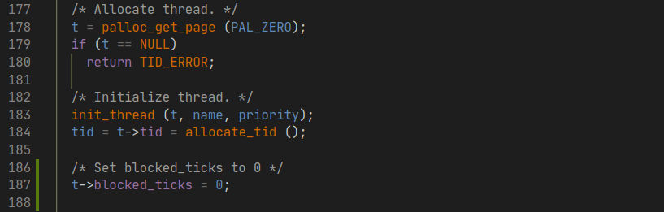

3. 新建一个 `thread_check_blocked(struct thread *t)` 函数检查线程的阻塞时间记录情况。
   之所以需要增加第二个 `void *aux` 指针的原因是这个函数将会被 `thread_foreach` 调用，
   而这个函数将会给 `hread_chheck_blocked` 传递一个 `aux` 指针。同时在 thread.h 头文
   件中添加声明。

    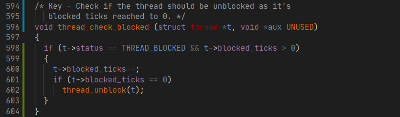
    

4. 在 `timer_interrupt()` 被调用的时候，对每一个线程都使用 `thread_for_each()` 函数
   调用 `thread_check_blocked()` 来处理阻塞状态。

    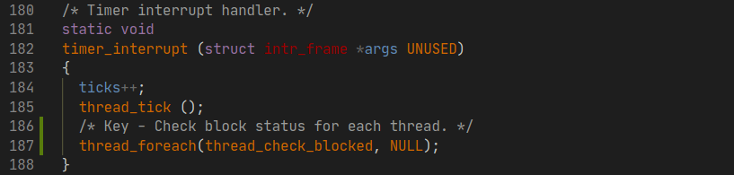

5. 最后修改 `timer_sleep()` 函数，使线程通过阻塞休眠而不是忙等待。

    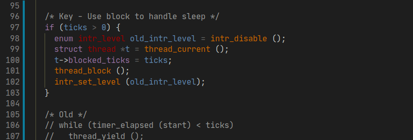

使用命令 `pintos -- run alarm-multiple` 检查运行结果，可以得到如下结果。

```shell
...
Executing 'alarm-multiple':
(alarm-multiple) begin
(alarm-multiple) Creating 5 threads to sleep 7 times each.
(alarm-multiple) Thread 0 sleeps 10 ticks each time,
(alarm-multiple) thread 1 sleeps 20 ticks each time, and so on.
(alarm-multiple) If successful, product of iteration count and
(alarm-multiple) sleep duration will appear in nondescending order.
(alarm-multiple) thread 0: duration=10, iteration=1, product=10
(alarm-multiple) thread 0: duration=10, iteration=2, product=20
(alarm-multiple) thread 1: duration=20, iteration=1, product=20
(alarm-multiple) thread 0: duration=10, iteration=3, product=30
(alarm-multiple) thread 2: duration=30, iteration=1, product=30
(alarm-multiple) thread 0: duration=10, iteration=4, product=40
(alarm-multiple) thread 1: duration=20, iteration=2, product=40
(alarm-multiple) thread 3: duration=40, iteration=1, product=40
(alarm-multiple) thread 0: duration=10, iteration=5, product=50
(alarm-multiple) thread 4: duration=50, iteration=1, product=50
(alarm-multiple) thread 0: duration=10, iteration=6, product=60
(alarm-multiple) thread 1: duration=20, iteration=3, product=60
(alarm-multiple) thread 2: duration=30, iteration=2, product=60
(alarm-multiple) thread 0: duration=10, iteration=7, product=70
(alarm-multiple) thread 1: duration=20, iteration=4, product=80
(alarm-multiple) thread 3: duration=40, iteration=2, product=80
(alarm-multiple) thread 2: duration=30, iteration=3, product=90
(alarm-multiple) thread 1: duration=20, iteration=5, product=100
(alarm-multiple) thread 4: duration=50, iteration=2, product=100
(alarm-multiple) thread 1: duration=20, iteration=6, product=120
(alarm-multiple) thread 2: duration=30, iteration=4, product=120
(alarm-multiple) thread 3: duration=40, iteration=3, product=120
(alarm-multiple) thread 1: duration=20, iteration=7, product=140
(alarm-multiple) thread 2: duration=30, iteration=5, product=150
(alarm-multiple) thread 4: duration=50, iteration=3, product=150
(alarm-multiple) thread 3: duration=40, iteration=4, product=160
(alarm-multiple) thread 2: duration=30, iteration=6, product=180
(alarm-multiple) thread 3: duration=40, iteration=5, product=200
(alarm-multiple) thread 4: duration=50, iteration=4, product=200
(alarm-multiple) thread 2: duration=30, iteration=7, product=210
(alarm-multiple) thread 3: duration=40, iteration=6, product=240
(alarm-multiple) thread 4: duration=50, iteration=5, product=250
(alarm-multiple) thread 3: duration=40, iteration=7, product=280
(alarm-multiple) thread 4: duration=50, iteration=6, product=300
(alarm-multiple) thread 4: duration=50, iteration=7, product=350
(alarm-multiple) end
Execution of 'alarm-multiple' complete.
```

product 现在以升序排列，修改完成。运行 `make check` 查看结果:

```shell
...
pass tests/threads/alarm-single
pass tests/threads/alarm-multiple
pass tests/threads/alarm-simultaneous
FAIL tests/threads/alarm-priority
pass tests/threads/alarm-zero
pass tests/threads/alarm-negative
...
```

除了在 Mission 2 中要解决的 alarm-priority 以外都显示通过测试。


### Misson 2: Priority Scheduling - 优先级调度

这一部分要求在 PintOS 中实现优先级调度。在 thread 的 PCB 中已经具有了 `priority` 项，优
先级最低从 `PRI_MIN` 到最高 `PRI_MAX` 。当 ready list 中出现了一个比当前正在运行的线程优
先级更高的线程的时候，当前的线程将会立即让出 CPU 。同时，当线程在等待一个信号量的时候，最高优
先级的线程将会被第一个唤醒。除此之外，实验还要求每一个线程可以在任意时候提高或降优先级，并且在
降低优先级后如果不是当前系统中优先级最高的线程，立即让出 CPU 。除此之外，需要实现的问题还有优
先级倒置、优先级捐赠。需要完成 `thread.c` 中的 `thread_set_priority()` 函数和
`thread_get_priority()` 函数。

分析目前的调度函数 `schedule()` ：

可以看到在第 12 行，函数通过调用 `next_thread_to_run()` 获取要调度的下一个线程，然后在第
20 行调用 `switch_threads(cur, next)` 把当前线程和要调度的下一个线程进行交换。

```c
/* Schedules a new process.  At entry, interrupts must be off and
   the running process's state must have been changed from
   running to some other state.  This function finds another
   thread to run and switches to it.

   It's not safe to call printf() until thread_schedule_tail()
   has completed. */
static void
schedule (void)
{
  struct thread *cur = running_thread ();
  struct thread *next = next_thread_to_run ();
  struct thread *prev = NULL;

  ASSERT (intr_get_level () == INTR_OFF);
  ASSERT (cur->status != THREAD_RUNNING);
  ASSERT (is_thread (next));

  if (cur != next)
    prev = switch_threads (cur, next);
  thread_schedule_tail (prev);
}
```

分析目前 `next_thread_to_run()` 的代码：

可以看到这个函数只是简单的返回 `ready_list` 中最前面的线程。如果队列为空，则返回一
`idle_thread` 空线程。而观察 `thread.c` 中添加线程方式，发现有三个函数在向 `ready_list`
中添加线程，分别是 `thread_list()` 、 `init_thread()` 、和 `thread_yield()` 。而这三
个函数都使用了 `list_push_back (&ready_list, &cur->elem)` 来添加。因此， PintOS 目前
使用的算法是 FIFO 调度。为了实现优先级调度，首先应当使线程进入队列的时候按照优先级的大小插入，
而不是直接放在后面。

```c
/* Chooses and returns the next thread to be scheduled.  Should
   return a thread from the run queue, unless the run queue is
   empty.  (If the running thread can continue running, then it
   will be in the run queue.)  If the run queue is empty, return
   idle_thread. */
static struct thread *
next_thread_to_run (void)
{
  if (list_empty (&ready_list))
    return idle_thread;
  else
    return list_entry (list_pop_front (&ready_list), struct thread, elem);
}
```

发现 `list.c` 内已经具有了方法 `list_insert_ordered()` ，可以将项目按照顺序插入。因此，
对于该过程，需要自行实现 `list_less_func()` 用于比较优先级然后把这三个具有安排线程的函数中
的调度函数从 `list_push_back()` 更改成 `list_insert_ordered()` 。

```c
/* Inserts ELEM in the proper position in LIST, which must be
   sorted according to LESS given auxiliary data AUX.
   Runs in O(n) average case in the number of elements in LIST. */
void
list_insert_ordered (struct list *list, struct list_elem *elem,
                     list_less_func *less, void *aux) { ... }
```

因此，对于该过程，需要自行实现 `list_less_func()` 用于比较优先级。然后把这三个具有安排线程的
函数中的调度函数从 `list_push_back()` 更改成 `list_insert_ordered()` 。除了当新的线程
出现的时候需要根据优先级进行调度和安排，当某一个线程的优先级改变并且比当前线程的优先级高的时候，
也需要内核立即让出程序，即调用 `thread_yield` 。所以，当有新的线程出现或者当某一线程优先级改
变的时候，也需要抢占式地改变当前正在运行的程序。

高优先级的线程在具备运行的机会时候，应当立即运行。因此，在这里需要做两个更改：

* 当新的线程建立时了，判断新线程的优先级，如果高则抢占。
* 更新一个线程的优先级时，判断更新后的优先级，如果高则抢占。

对于锁的唤醒问题，当有一系列程序等待锁释放的时候，需要最先唤醒优先级最高的程序。观察现有的
`lock_aquire()` 函数：

```c
/* Acquires LOCK, sleeping until it becomes available if
   necessary.  The lock must not already be held by the current
   thread.

   This function may sleep, so it must not be called within an
   interrupt handler.  This function may be called with
   interrupts disabled, but interrupts will be turned back on if
   we need to sleep. */
void
lock_acquire (struct lock *lock)
{
  ASSERT (lock != NULL);
  ASSERT (!intr_context ());
  ASSERT (!lock_held_by_current_thread (lock));

  sema_down (&lock->semaphore);
  lock->holder = thread_current ();
}
```

观察 `sema_down()` 函数的注释：

```c
/* Down or "P" operation on a semaphore.  Waits for SEMA's value
   to become positive and then atomically decrements it.

   This function may sleep, so it must not be called within an
   interrupt handler.  This function may be called with
   interrupts disabled, but if it sleeps then the next scheduled
   thread will probably turn interrupts back on. */
void
sema_down (struct semaphore *sema) { ... }
```

可以发现 `sema_down()` 是信号量的 P 操作。而对于这个信号量，原代码中的定义如下：

```c
/* A counting semaphore. */
struct semaphore
  {
    unsigned value;             /* Current value. */
    struct list waiters;        /* List of waiting threads. */
  };
```

可以看到维持了一个等待线程的队列。但进一步观察发现所有对 `waiters` 队列的操作都是同样采用的
`FIFO` 算法，所以这里需要修改所有对 `waiters` 队列的，使其变成优先级队列。

查看现有锁的定义发现其不支持多个正在访问这个锁的线程的记录，需要修改。为了解决优先级捐赠问题需要
有以下修改步骤：

* 需要修改线程的结构体定义来存储线程是否被捐赠了优先级，之前的优先级和新的优先级。
* 在一个线程获取一个锁的时候，如果拥有这个锁的线程优先级比自己低就提高它的优先级，如果还有其他
  线程在使用这个锁，也会相应地提升这个线程的优先级。
* 如果线程同时被多个线程捐赠优先级，线程的优先级将会变成这些捐赠线程的优先级中的最高值。

```c
/* Lock. */
struct lock
  {
    struct thread * holder;     /* Thread holding lock (for debugging). */
    struct semaphore semaphore; /* Binary semaphore controlling access. */
  };
```

为了实现 `list_insert_ordered()` 函数，首先需要自行编写一个比较优先级的函数。在
`thread.c` 加入比较函数 `compare_priority()` ，同时在 `thread.h` 中声明：

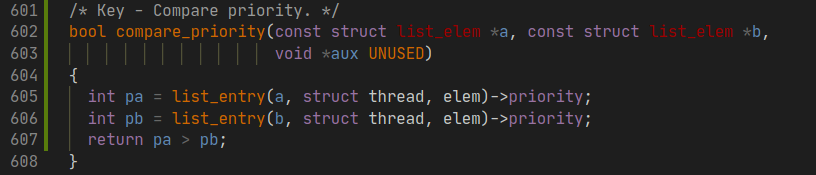


修改 `yield()` 中的调度语句：


另两个函数 `thread_unblock()` 同样做相同更改：

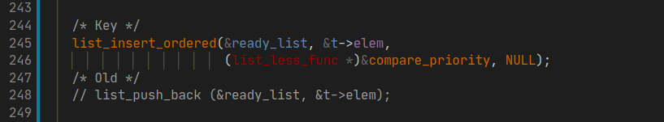

对 `init_thread()` ，传递的参数为 `all_list` 和 `allelem` 。

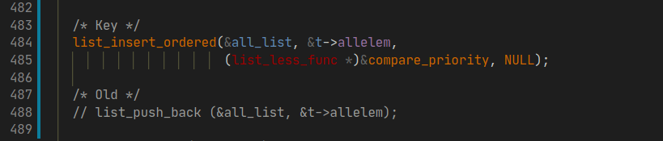

接下来修改设置优先级函数中的语句：

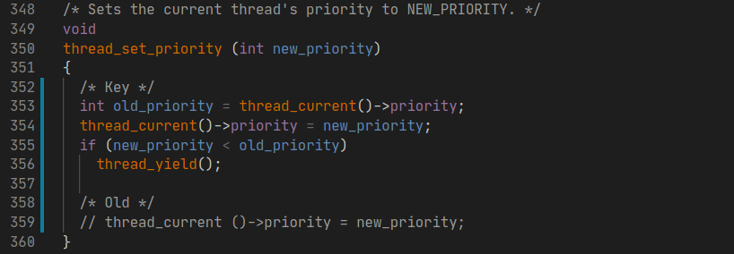

至此，修改了 `thread.c` 中的优先级调度程序，已经可以通过部分和优先级有关的测试：

```shell
pass tests/threads/priority-fifo
pass tests/threads/priority-preempt
```

接下来对于优先级捐赠问题，首先需要 `thread` 定义中加入以下数据结构：

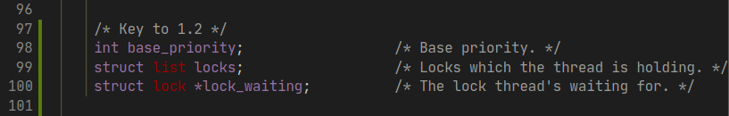

然后为 `lock` 的定义加入以下两个数据结构。前者是当前线程在信号量队列中位置（在原始的队列中，当
前线程一定位于队列的首部），后者则是表示该锁的信号量队列中线程的最高优先级：

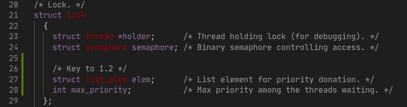

为了让修改的数据结构能够得到初始化，修改线程的初始化函数 `init_thread` 和锁的初始化函数
`lock_init` ：

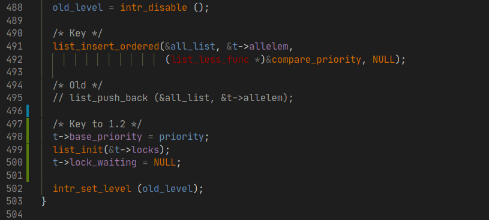
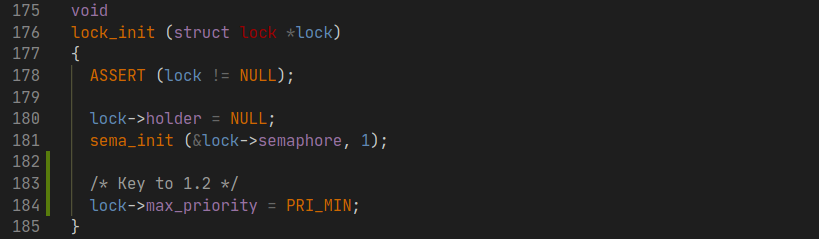

由于全程都在涉及关于锁的操作，所以先对获取锁的函数 `lock_aquire()` 进行修改。也就是要让每一
个锁在获得的时候首先检测比较想要获得这个锁的线程的优先级是否比锁内存储的 `max_priority` 大，
如果更大，则需要将这个锁内存储的 `max_priority` 设置为最大的优先级，并且对线程进行优先级捐赠
操作：

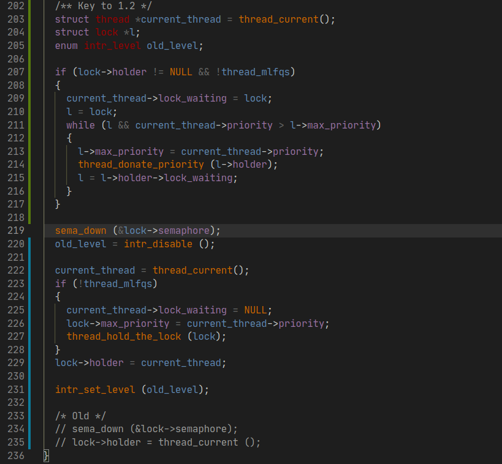

对应的在 `thread.c` 中实现 `thread_donate_priority()` 和 `thread_hold_the_lock()`
函数。其中 `thread_donate_priority` 需要自行实现一个对 `t` 进行优先级更新的函数，因为被捐
赠优先级的线程不一定是正在运行的线程，之前程序自带的 `thread_set_priority()` 只能满足更新当
前线程的优先级，所以需要修改。而 `thread_hold_the_lock()` 则是让线程获得当前锁。由于如果线
程拥有一个锁，那么线程的优先级一定要是拥有这个锁的队列中的最大值，所以如果锁的优先级大于线程的优
先级，需要相应地更新线程的优先级，然后把这个锁加入到线程拥有的锁的队列中。这两个函数的代码如下：

```c
/* Key to 1.2 - Let thread hold a lock */
void thread_hold_the_lock (struct lock *lock)
{
  enum intr_level old_level = intr_disable();
  list_insert_ordered (&thread_current()->locks,
                       &lock->elem, lock_cmp_priority, NULL);

  if (lock->max_priority > thread_current ()->priority)
    {
      thread_current ()->priority = lock->max_priority;
      thread_yield ();
    }

  intr_set_level (old_level);
}

/* Key to 1.2 - Donate current priority to thread t. */
void thread_donate_priority (struct thread *t)
{
  enum intr_level old_level = intr_disable ();
  thread_update_priority (t);

  if (t->status == THREAD_READY)
    {
      list_remove (&t->elem);
      list_insert_ordered (&ready_list, &t->elem, compare_priority, NULL);
    }
  intr_set_level (old_level);
}
```

接下来对于 `thread_update_priority()` 函数编写如下。当前已经有的修改函数
`thread_set_priority()` 只能用于修改当前正在运行的优先级。不过这个函数可以修改一下用于更新
当前运行线程的 `base_priority` 并根据新的优先级来判断是否需要 yield 线程。在这之前，先完善
修改当前线程优先级的函数 `thread_set_priority()` 如下：

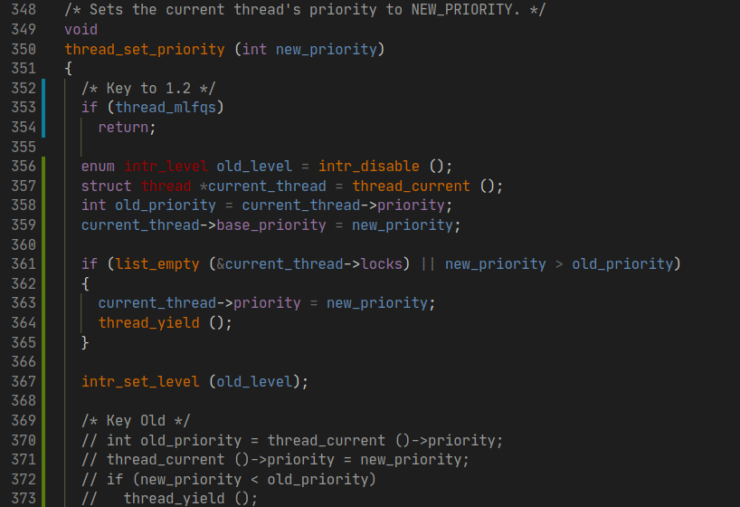

此后再编写一个 `thread_update_priority()` 函数来更新当前正在运行的线程的优先级。使用这个函
数来应对多个线程同时在对一个线程进行优先级捐赠的情况。为了使设置的优先级为锁的最大值，需要对某个
线程所获得的锁进行排序，然后取出队列中最前的元素作为当前线程的新优先级。

```c
/* Key to 1.2 - Update priority. */
void thread_update_priority (struct thread *t)
{
	enum intr_level old_level = intr_disable ();
	int max_priority = t->base_priority;
	int lock_priority;

	if (!list_empty (&t->locks))
    {
  		list_sort (&t->locks, lock_cmp_priority, NULL);
  		lock_priority = list_entry (list_front (&t->locks),
                                  struct lock, elem)->max_priority;
  		if (lock_priority > max_priority)
  			max_priority = lock_priority;
  	}

	t->priority = max_priority;
	intr_set_level (old_level);
}
```

为了实现关于锁的排序函数，还需实现 `lock_cmp_priority` 函数如下：

```c
/* Key to 1.2 - Compare priority in locks. */
bool lock_cmp_priority (const struct list_elem *a,
                        const struct list_elem *b, void *aux UNUSED)
{
  int max_a = list_entry (a, struct lock, elem)->max_priority;
  int max_b = list_entry (b, struct lock, elem)->max_priority;
  return max_a > max_b;
}
```

以上实现了获取锁的逻辑。而对于锁的释放，需要先把锁从线程的 `lock` 队列中删除，然后将锁设置为不
被任何线程占用，最后再进行信号量的 V 操作。这里编写一个 `thread_remove_lock()` 函数来实现：

```c
/* Key to 1.2 - Remove lock. */
void thread_remove_lock(struct lock *lock)
{
	enum intr_level old_level = intr_disable ();
	list_remove (&lock->elem);
	thread_update_priority (thread_current ());
	intr_set_level (old_level);
}
```

相应地，在进行 `lock_release()` 的时候调用该函数：

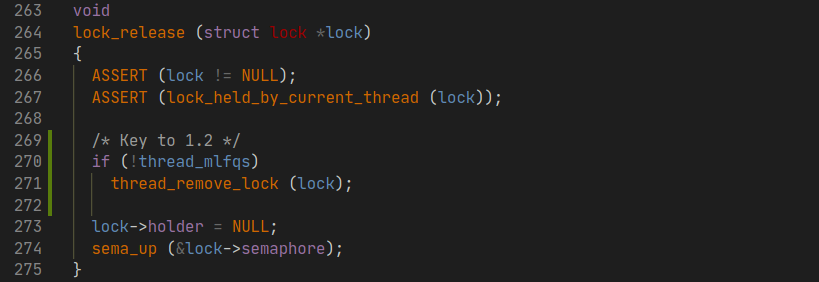

最后将剩下的队列修改为优先级队列。首先修改 `synch.c` 中的 `cond_signal()` 函数：

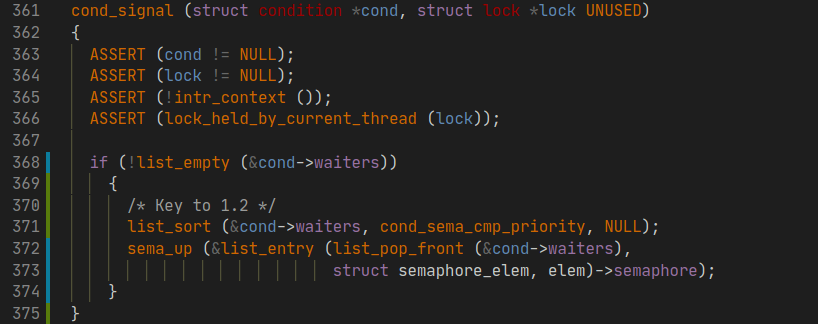

增加相应的排序函数 `cond_sema_cmp_priority()` ：

```c
/* Key to 1.2 */
bool cond_sema_cmp_priority (const struct list_elem *a,
                             const struct list_elem *b, void *aux UNUSED)
{
	struct semaphore_elem *sa = list_entry (a, struct semaphore_elem, elem);
	struct semaphore_elem *sb = list_entry (b, struct semaphore_elem, elem);
  int priority_a = list_entry (list_front (&sa->semaphore.waiters),
                               struct thread, elem)->priority;
  int priority_b = list_entry (list_front (&sb->semaphore.waiters),
                               struct thread, elem)->priority;
	return priority_a > priority_b;
}
```

再修改 `waiters` 为优先级队列。对 `sema_down` 和 `sema_up` 修改如下：

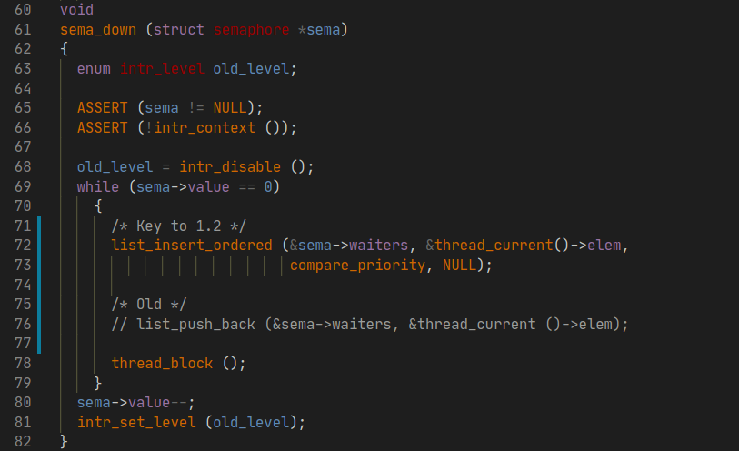
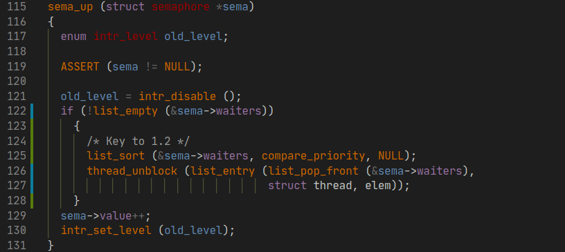

记得在 `threads.h` 与 `synch.h` 头文件中声明另外添加的函数：

```c
/* threads.h */
void thread_check_blocked(struct thread *, void *);
bool compare_priority(const struct list_elem *,
                      const struct list_elem *, void *);
bool lock_cmp_priority (const struct list_elem *,
                        const struct list_elem *, void *);
void thread_hold_the_lock (struct lock *);
void thread_remove_lock(struct lock *);
void thread_donate_priority (struct thread *);
void thread_update_priority (struct thread *);
```

```c
/* synch.h */
bool cond_sema_cmp_priority (const struct list_elem *,
                             const struct list_elem *, void *);
```

完成以上步骤以后， priority 部分的测试可以通过，优先级调度部分的修改完成。

```shell
pass tests/threads/priority-change
pass tests/threads/priority-donate-one
pass tests/threads/priority-donate-multiple
pass tests/threads/priority-donate-multiple2
pass tests/threads/priority-donate-nest
pass tests/threads/priority-donate-sema
pass tests/threads/priority-donate-lower
pass tests/threads/priority-fifo
pass tests/threads/priority-preempt
pass tests/threads/priority-sema
pass tests/threads/priority-condvar
pass tests/threads/priority-donate-chain
```


### Mission 3: Advanced Scheduler - 高级调度

在这个部分中，需要自行实现类似于BSD调度程序的多级反馈队列调度程序，以减少在系统上运行作业的平均
响应时间。

与优先级调度调度程序一样，高级调度程序同样基于线程的优先级来调度线程。但是高级调度程序
不会执行优先级捐赠。必须编写必要的代码，以允许在 Pintos 启动时选择调度算法策略。默认情况下，优
先级调度程序必须处于活动状态，但必须能够使用 `-mlfqs` 内核选项选择 4.4BSD 调度程序。在
`main()` 函数中 `parse_options()` 解析选项时，传递此选项会将 `threads/thread.h` 中声明
的 `thread_mlfqs` 设置为 `true` 。所以为了完成这个任务，在 Mission 2 中的关于优先级捐赠的
代码需要加入 `if (!thread_mlpfs)` 进行判断，暂时关闭优先级调度的代码。

启用 BSD 调度程序后，线程不再直接控制自己的优先级。应忽略 `thread_create()` 的优先级参数，
以及对 `thread_set_priority()` 的任何调用，并且 `thread_get_priority()` 应返回调度程序
设置的线程的当前优先级。高级调度程序不会在以后的任何项目中使用。而对于每个线程的优先级的更新，
应当使用官方文档附录中的算法实现。

通用调度程序的目标是平衡线程的不同调度需求。执行大量 I/O 的线程需要快速响应时间以保持输入和输出
设备忙，但需要很少的CPU时间。另一方面，绑定计算的线程需要花费大量 CPU 时间来完成其工作，但不需
要快速响应时间。其他线程介于两者之间， I/O 周期被计算周期打断，因此需求随时间变化。精心设计的
调度程序通常可以同时满足具有所有这些要求的线程。

我们必须实现附录 B 中描述的调度程序。调度程序类似于 [McKusick] 中描述的调度程序，是多级反馈
队列调度程序的一个示例。这种类型的调度程序维护几个可立即运行的线程队列，其中每个队列包含具有不同
优先级的线程。在任何给定时间，调度程序从最高优先级的非空队列中选择一个线程。如果最高优先级队列包
含多个线程，则它们以“循环”顺序运行。

调度程序的多个方面需要在一定数量的计时器滴答之后更新数据。在每种情况下，这些更新应该在任何普通
内核线程有机会运行之前发生，这样内核线程就不可能看到新增的 `timer_ticks()` 值而是旧的调度程
序数据值。

首先需要关注的是对于每个线程的 `nice` 值，即处理器亲和度。 `nice` 值为 0 不会影响线程优先级。
 `nice` 值从 1 至 20 ，会降低线程的优先级，并导致它放弃一些原本会收到的 CPU 时间。另一种情
 况， `nice` 值从 -20 到 -1 ，往往会从其他线程中抢占CPU时间。每 4 个时间周期进行算出线程的
 新优先级。在 `thread.c` 中，已经预留了两个需要填补的函数：

```c
int thread_get_nice (void);
void thread_set_nice (int new_nice);
```

对于公式中的 `recent_cpu` ，需每个 `timer_tick` 都计算一次。我们希望 `recent_cpu` 可以
表征每个进程“最近”收到多少CPU运行时间。此外，作为一种改进，最新收到的 CPU 时间应该比其之前的
CPU 时间权重更大。一种方法是使用 n 个元素的数组来跟踪在最后 n 秒的每一个中接收的CPU时间。然而
这种方法每线程需要 O(n) 空间,并且每次计算新加权平均值需要 O(n) 时间。相反，实验手册建议使用
指数加权平均数计算。

在创建的第一个线程中, `recent_cpu` 的初始值为 0 ，或者在其他新线程中为其父进程值。每次发生
定时器中断时，除非空闲线程正在运行，否则 `recent_cpu` 仅对正在运行的线程递增 1 。此外，每秒
一次，使用以下公式为每个线程（无论是运行，准备还是阻塞）重新计算 `recent_cpu` 的值，其中
`load avg` 是准备运行的线程数的移动平均值。如果 `load avg` 为 1 ，表示单个线程正在竞争
CPU，那么 `recent_cpu` 的当前值在 log(2/3, 0.1) ≈ 6 秒内衰减到原值的 0.1。如果
`load_avg` 为 2 ，则衰减到原值的 0.1 需要 log(3/4, 0.1) ≈ 8 秒。结果是 `recent_cpu`
估计了线程“最近”收到的 CPU 时间量，衰减率与竞争 CPU 的线程数成反比。

一些测试所做的假设要求在系统计数器每达到一秒完全重新计算 `recent_cpu` ，即条件
`timer_ticks () % TIMER_FREQ == 0` 成立。

对于具有负 `nice` 值的线程， `recent_cpu` 的值可能为负，所以不应当假设 `recent_cpu` 的值
一直大于 0 。此外，还需需要考虑此公式中的计算顺序。先计算 `recent_cpu` 的系数，然后再做乘法，
否则可能会产生溢出。

必须实现在 `threads/thread.c` 中的 `thread_get_recent_cpu()` 函数：

```c
int thread_get_recent_cpu (void);
```

而为了计算 `recent_cpu` ，又需要计算 `load_avg` ，即系统的平均负载量。它估计在过去一分钟内，
在准备队列中的平均线程数。像 `recent_cpu` 一样，它也是指数加权的平均值。与 `priority` 和
`recent_cpu` 不同， `load_avg` 是系统范围的，而不是特定于线程的。在系统启动时，它被初始化
为 0 。此后每个 `timer_ticker` 更新一次。

`ready_thread` 是在更新时运行或准备运行的线程数（不包括空闲线程）。

有些测试假设当计时器达到 1 秒倍数时，即当 `timer_ticks () % TIMER_FREQ == 0` 时，必须要
重新更新 `load_avg` ，而不是在其它时间。

必须实现位于 `threads/thread.c` 中的函数：

```c
int thread_get_load_avg (void);
```

最后，为了计算出 `recent_cpu` 值和 `load_avg` 值，需要我们自行实现定点数的运算。

根据官方实验手册的知道，实现定点运算基本思想是将定点数运算转换成整数的运算。将整数的最右边的几位
视为表示分数。我们可以将带符号的 32 位整数的最低 14 位指定为小数位，这样整数 x 代表实数
x/214 。叫做 17.14 定点数，最大能够表示 (231-1)/214 ，近似于 131071.999 。

假设我们使用 p.q 的定点数格式，并且设 f = 2q 。根据上面的定义，我们可以通过乘以 f 将整数或实
数转换为 p.q 格式。例如，基于 17.14 格式的定点数转换 59/60 ， (59/60)214 = 16110。将定点
数转换为整数则除以 f 。

实验手册提供了总结了如何在 C 中实现定点的算术运算。在表中，x 和 y 是定点数， n 是整数，定点数
是带符号的 p.q 格式，其中 p + q = 31， f 的值应当为 1 << q 。

首先,新的算法需要用到之前的内核中不支持的定点数运算。为了实现定点数的运算,
在 thread 目录下新建一个 fixed_point.h 并编写如下宏:

### Note

## Project 2: User Programs

### Overview

### Mission 1: Argument Passing - 参数传递

### Mission 2: Process Termination Messages - 进程终止消息

### Mission 3: System Calls - 系统调用

### Mission 4: Denying Writes to Executables - 拒接写可执行文件
