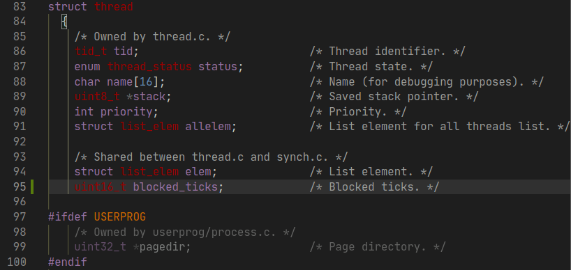
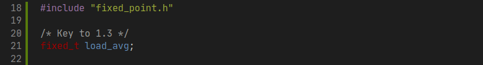
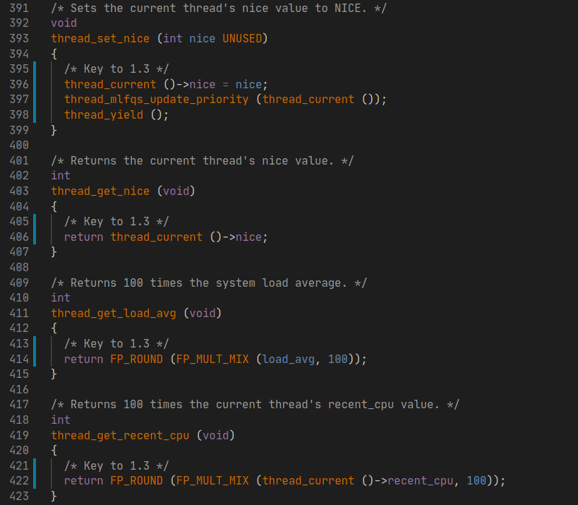

# PintOS Project Report

Edited by Homan Wong - 10195101563 - Jan 2020

## Prerequisites

### Install PintOS

* Reference: <https://www.scs.stanford.edu/20wi-cs140/pintos/pintos_12.html>
* Reference: <https://www.cnblogs.com/crayygy/p/ubuntu-pintos.html>
* Reference: <https://blog.csdn.net/sarah_trois/article/details/53958666>

系统环境： Ubuntu 18.04 LTS

参考文档中所注明需要的依赖，先尝试安装所有依赖包来避免依赖问题。

```shell
$ sudo apt install buid-essential
$ sudo apt install xorg-dev
$ sudo apt install bison
$ sudo apt install libgtk2.0-dev
$ sudo apt install libc6:i386 libgcc1:i386
$ sudo apt install gcc-4.6-base:i386 libstdc++5:i386 libstdc++6:i386
$ sudo apt install libncurses5:i386
$ sudo apt install g++-multilib
```

使用 `git clone http://cs140.stanford.edu/pintos.git` 下载仓库。为了能够快速调用
`pintos` 命令，复制以下二进制文件到 `/user/bin` 。

```shell
$ cd ~/Documents/Repositories/PintOS/src/utils
$ sudo cp backtrace /usr/bin
$ sudo cp pintos /usr/bin
$ sudo cp pintos-gdb /usr/bin
$ sudo cp pintos-mkdisk /usr/bin
$ sudo cp Pintos.pm /usr/bin
```

为了方便调试，复制 `pintos-gdb` 到 `/user/bin` 。更改 `pintos-gdb` 第四行的
内容为 `GDBMACROS=/usr/bin/gdb-macros` 。

```shell
$ cd ~/Documents/Repositories/PintOS/src/misc
$ sudo cp gdb-macros /usr/bin
$ sudo gedit /usr/bin/pintos-gdb
```

给源代码中 `pintos` 等文件添加可执行权限。

```shell
$ cd ~/Documents/Repositories/PintOS/src/usr/bin
$ sudo chmod a+rx backtrace
$ sudo chmod a+rx pintos*
$ sudo chmod a+rx gdb-macros
$ sudo chmod a+rx Pintos.pm
$ test pintos-gdb
```


### Install Bochs

在实验测试中，经实践为了兼容性最后选择下载 2.6.7 版本的 Bochs 源码压缩包进行安装。下载的包名
为 `bochs-2.6.7.tar.gz` 。需注意在 configure 的时候要标记 `--enable-gdb-stub` 和
`--with-nogui` ，否则稍后 debug 与 `make check` 的时候会出现问题。

```shell
$ tar -zxvf bochs-2.6.7.tar.gz
$ cd boches-2.6.7
$ ./configure --enable-gdb-stub --with-nogui
$ make
$ sudo make install
```


### Compile and debug

在 `src/threads` 目录下编译。

```shell
$ cd ~/Documents/Repositories/PintOS/src/threads
$ make
```

在 `src/threads/build` 目录下，以 debug 的方式启动 PintOS 。

```shell
$ cd ~/Documents/Repositories/PintOS/src/threads/build
$ pintos --gdb -s -- run alarm-priority
```

依旧在 `src/threads/build` 目录下，启动 gdb 调试界面。

```shell
$ cd ~/Documents/Repositories/PintOS/src/threads/build
$ gdb kernel.o
$ target remote localhost: 1234
$ continue
```

要检查结果，在 `src/threads/build` 目录下运行 `make check` 。

```shell
$ cd ~/Documents/Repositories/PintOS/src/threads/build
$ make check
FAIL tests/threads/alarm-single
FAIL tests/threads/alarm-multiple
FAIL tests/threads/alarm-simultaneous
FAIL tests/threads/alarm-priority
FAIL tests/threads/alarm-zero
FAIL tests/threads/alarm-negative
FAIL tests/threads/priority-change
FAIL tests/threads/priority-donate-one
FAIL tests/threads/priority-donate-multiple
FAIL tests/threads/priority-donate-multiple2
FAIL tests/threads/priority-donate-nest
FAIL tests/threads/priority-donate-sema
FAIL tests/threads/priority-donate-lower
FAIL tests/threads/priority-fifo
FAIL tests/threads/priority-preempt
FAIL tests/threads/priority-sema
FAIL tests/threads/priority-condvar
FAIL tests/threads/priority-donate-chain
FAIL tests/threads/mlfqs-load-1
FAIL tests/threads/mlfqs-load-60
FAIL tests/threads/mlfqs-load-avg
FAIL tests/threads/mlfqs-recent-1
FAIL tests/threads/mlfqs-fair-2
FAIL tests/threads/mlfqs-fair-20
FAIL tests/threads/mlfqs-nice-2
FAIL tests/threads/mlfqs-nice-10
FAIL tests/threads/mlfqs-block
27 of 27 tests failed.
../../tests/Make.tests:26: recipe for target 'check' failed
make: *** [check] Error 1
```

至此 PintOS 的实验环境已经搭建完成。


## Project 1: Threads

### Overview

面对 PintOS 较为复杂的结构，先熟悉一下 PintOS 项目各个目录的作用。

1. threads/ - 内核的源代码
2. userprog/ - 用户程序加载代码
3. vm/ - 虚拟内存目录
4. filesys/ - 文件系统目录
5. devics/ - I/O 设备驱动目录
6. lib/ - 部分标准 C 语言的函数
7. lib/kernel - 部分只在 PintOS 中有的 C 语言函数
8. lib/user - 包含一些头文件和只在 Pintos 中有的一些 C 语言函数
9. tests/ - Project 的测试案例
10. examples/ - Projcet 2 中的一些样例
11. misc/ & utils/ - 工具和辅助程序

注：报告中的以代码块的形式展示新增的函数与定义，或是引用原有的代码。相应地，以截图的方式展示的
代码表示其是在源代码一定基础上更改的内容。


### Mission 1: Alarm Clock - 忙等待

在这个任务中需要重新实现 `devices/timer/c` 目录下的 `timer_sleep()` 函数。虽然当前代码
提供了一个实现方式，但它的实现为忙等待，即它在循环中检查当前时间是否已经过去 ticks 个时钟，
并循环调用 `thread_yield()` 直到循环结束。现在需要重新实现这个函数来避免忙等待。对于
`timer_msleep()` 、 `timer_usleep()` 、 `timer_nsleep()` 等函数，其将会自动定期调用
`timer_sleep()` ，因此不需要修改。

分析 `timer_sleep()` 的代码：

1. 首先， `start` 记录了进入这个函数的当前时间。
2. 然后判断 `intr_get_level()` 的返回值是否为真，即是否启用了中断，如果没有则
   `kernel panic` 。
3. 利用 `timer_elapsed()` 判断当前经过的时间和 `start` 之间的差值。
4. 判断当前流逝的时间是否超过给定的 ticks ，如果没有，执行 `thread_yield()` ，让线程
   休眠。

```c
/* Sleeps for approximately TICKS timer ticks. Interrupts must
   be turned on. */
void
timer_sleep (int64_t ticks)
{
  int64_t start = timer_ticks ();

  ASSERT (intr_get_level () == INTR_ON);
  while (timer_elapsed (start) < ticks)
    thread_yield ();
}
```

然后寻找并分析 `thread_yield()` 函数。可以使用 VSCode 项目内查找其所在文件
`threads/threads.c`：

1. 首先通过 `thread_current()` 获得当前正在运行的线程。这个结构体指针中的线程结构体包含：
   线程 ID、线程状态、线程名、栈指针、优先级、线程链表、线程项、⻚目录和一个用于检查栈溢出的量。
2. 获取 `old_level` ，即调用函数的时候的中断状态。同时发现在 `intr_disable()` 函数中会
   暂时禁用中断。
3. 判断当前的线程是否为 `idle_thread` ，如果不是，则将现在这个线程 push 到 `ready_list`
   的尾部。
4. 调度当前线程，同时将中断状态设置回刚调用 `thread_yield()` 时的状态。

```c
/* Yields the CPU. The current thread is not put to sleep and
   may be scheduled again immediately at the scheduler's whim. */
void
thread_yield (void)
{
  struct thread *cur = thread_current ();
  enum intr_level old_level;

  ASSERT (!intr_context ());

  old_level = intr_disable ();
  if (cur != idle_thread)
    list_push_back (&ready_list, &cur->elem);
  cur->status = THREAD_READY;
  schedule ();
  intr_set_level (old_level);
}
```

回顾 `timer_sleep()` 函数，可以发现这个函数是一个自旋锁，将会一直循环检查当前经过的时间并且
调用 `thread_yield()` 来让线程休眠，会出现忙等待的现象。也就是为了让线程休眠特定时间，这个
函数就在这一段时间里反复把线程从运行状态丢到就绪列表的最后。当调度到来时，如果时间没到，又一次
把线程放在最后，这样做效率低下。

为了解决这个问题，可以在线程第一次调用 `timer_sleep()` 的时候，通过调用 `thread_block()`
函数来讲线程的状态设置为阻塞，同时记录下需要阻塞的时间，至此， `timer_sleep()` 就完成了自己
的工作，把唤醒的工作留给其他函数。这样的话，当在每一次中断，即调用 `timer_interrupt()` 的
时候，都需要把所有被阻塞的线程内记录的阻塞时间信息 -1，如果减到了 0，则 unblock 线程，供后续
调度。因此对代码进行以下修改：

1. 在 thread 的结构体，也就是 PCB 中加入一项 `blocked_ticks` 。

    

2. 在初始化线程调用 `thread_create()` 的时候，将 `blocked_ticks` 设置为 0 。

    

3. 新建一个 `thread_check_blocked(struct thread *t)` 函数检查线程的阻塞时间记录情况。
   之所以需要增加第二个 `void *aux` 指针的原因是这个函数将会被 `thread_foreach` 调用，
   而这个函数将会给 `hread_chheck_blocked` 传递一个 `aux` 指针。同时在 thread.h 头文
   件中添加声明。

    
    

4. 在 `timer_interrupt()` 被调用的时候，对每一个线程都使用 `thread_for_each()` 函数
   调用 `thread_check_blocked()` 来处理阻塞状态。

    

5. 最后修改 `timer_sleep()` 函数，使线程通过阻塞休眠而不是忙等待。

    

使用命令 `pintos -- run alarm-multiple` 检查运行结果，可以得到如下结果。

```shell
...
Executing 'alarm-multiple':
(alarm-multiple) begin
(alarm-multiple) Creating 5 threads to sleep 7 times each.
(alarm-multiple) Thread 0 sleeps 10 ticks each time,
(alarm-multiple) thread 1 sleeps 20 ticks each time, and so on.
(alarm-multiple) If successful, product of iteration count and
(alarm-multiple) sleep duration will appear in nondescending order.
(alarm-multiple) thread 0: duration=10, iteration=1, product=10
(alarm-multiple) thread 0: duration=10, iteration=2, product=20
(alarm-multiple) thread 1: duration=20, iteration=1, product=20
(alarm-multiple) thread 0: duration=10, iteration=3, product=30
(alarm-multiple) thread 2: duration=30, iteration=1, product=30
(alarm-multiple) thread 0: duration=10, iteration=4, product=40
(alarm-multiple) thread 1: duration=20, iteration=2, product=40
(alarm-multiple) thread 3: duration=40, iteration=1, product=40
(alarm-multiple) thread 0: duration=10, iteration=5, product=50
(alarm-multiple) thread 4: duration=50, iteration=1, product=50
(alarm-multiple) thread 0: duration=10, iteration=6, product=60
(alarm-multiple) thread 1: duration=20, iteration=3, product=60
(alarm-multiple) thread 2: duration=30, iteration=2, product=60
(alarm-multiple) thread 0: duration=10, iteration=7, product=70
(alarm-multiple) thread 1: duration=20, iteration=4, product=80
(alarm-multiple) thread 3: duration=40, iteration=2, product=80
(alarm-multiple) thread 2: duration=30, iteration=3, product=90
(alarm-multiple) thread 1: duration=20, iteration=5, product=100
(alarm-multiple) thread 4: duration=50, iteration=2, product=100
(alarm-multiple) thread 1: duration=20, iteration=6, product=120
(alarm-multiple) thread 2: duration=30, iteration=4, product=120
(alarm-multiple) thread 3: duration=40, iteration=3, product=120
(alarm-multiple) thread 1: duration=20, iteration=7, product=140
(alarm-multiple) thread 2: duration=30, iteration=5, product=150
(alarm-multiple) thread 4: duration=50, iteration=3, product=150
(alarm-multiple) thread 3: duration=40, iteration=4, product=160
(alarm-multiple) thread 2: duration=30, iteration=6, product=180
(alarm-multiple) thread 3: duration=40, iteration=5, product=200
(alarm-multiple) thread 4: duration=50, iteration=4, product=200
(alarm-multiple) thread 2: duration=30, iteration=7, product=210
(alarm-multiple) thread 3: duration=40, iteration=6, product=240
(alarm-multiple) thread 4: duration=50, iteration=5, product=250
(alarm-multiple) thread 3: duration=40, iteration=7, product=280
(alarm-multiple) thread 4: duration=50, iteration=6, product=300
(alarm-multiple) thread 4: duration=50, iteration=7, product=350
(alarm-multiple) end
Execution of 'alarm-multiple' complete.
```

product 现在以升序排列，修改完成。运行 `make check` 查看结果:

```shell
...
pass tests/threads/alarm-single
pass tests/threads/alarm-multiple
pass tests/threads/alarm-simultaneous
FAIL tests/threads/alarm-priority
pass tests/threads/alarm-zero
pass tests/threads/alarm-negative
...
```

除了在 Mission 2 中要解决的 alarm-priority 以外都显示通过测试。


### Misson 2: Priority Scheduling - 优先级调度

这一部分要求在 PintOS 中实现优先级调度。在 thread 的 PCB 中已经具有了 `priority` 项，优
先级最低从 `PRI_MIN` 到最高 `PRI_MAX` 。当 ready list 中出现了一个比当前正在运行的线程优
先级更高的线程的时候，当前的线程将会立即让出 CPU 。同时，当线程在等待一个信号量的时候，最高优
先级的线程将会被第一个唤醒。除此之外，实验还要求每一个线程可以在任意时候提高或降优先级，并且在
降低优先级后如果不是当前系统中优先级最高的线程，立即让出 CPU 。除此之外，需要实现的问题还有优
先级倒置、优先级捐赠。需要完成 `thread.c` 中的 `thread_set_priority()` 函数和
`thread_get_priority()` 函数。

分析目前的调度函数 `schedule()` ：

可以看到在第 12 行，函数通过调用 `next_thread_to_run()` 获取要调度的下一个线程，然后在第
20 行调用 `switch_threads(cur, next)` 把当前线程和要调度的下一个线程进行交换。

```c
/* Schedules a new process.  At entry, interrupts must be off and
   the running process's state must have been changed from
   running to some other state.  This function finds another
   thread to run and switches to it.

   It's not safe to call printf() until thread_schedule_tail()
   has completed. */
static void
schedule (void)
{
  struct thread *cur = running_thread ();
  struct thread *next = next_thread_to_run ();
  struct thread *prev = NULL;

  ASSERT (intr_get_level () == INTR_OFF);
  ASSERT (cur->status != THREAD_RUNNING);
  ASSERT (is_thread (next));

  if (cur != next)
    prev = switch_threads (cur, next);
  thread_schedule_tail (prev);
}
```

分析目前 `next_thread_to_run()` 的代码：

可以看到这个函数只是简单的返回 `ready_list` 中最前面的线程。如果队列为空，则返回一
`idle_thread` 空线程。而观察 `thread.c` 中添加线程方式，发现有三个函数在向 `ready_list`
中添加线程，分别是 `thread_list()` 、 `init_thread()` 、和 `thread_yield()` 。而这三
个函数都使用了 `list_push_back (&ready_list, &cur->elem)` 来添加。因此， PintOS 目前
使用的算法是 FIFO 调度。为了实现优先级调度，首先应当使线程进入队列的时候按照优先级的大小插入，
而不是直接放在后面。

```c
/* Chooses and returns the next thread to be scheduled.  Should
   return a thread from the run queue, unless the run queue is
   empty.  (If the running thread can continue running, then it
   will be in the run queue.)  If the run queue is empty, return
   idle_thread. */
static struct thread *
next_thread_to_run (void)
{
  if (list_empty (&ready_list))
    return idle_thread;
  else
    return list_entry (list_pop_front (&ready_list), struct thread, elem);
}
```

发现 `list.c` 内已经具有了方法 `list_insert_ordered()` ，可以将项目按照顺序插入。因此，
对于该过程，需要自行实现 `list_less_func()` 用于比较优先级然后把这三个具有安排线程的函数中
的调度函数从 `list_push_back()` 更改成 `list_insert_ordered()` 。

```c
/* Inserts ELEM in the proper position in LIST, which must be
   sorted according to LESS given auxiliary data AUX.
   Runs in O(n) average case in the number of elements in LIST. */
void
list_insert_ordered (struct list *list, struct list_elem *elem,
                     list_less_func *less, void *aux) { ... }
```

因此，对于该过程，需要自行实现 `list_less_func()` 用于比较优先级。然后把这三个具有安排线程的
函数中的调度函数从 `list_push_back()` 更改成 `list_insert_ordered()` 。除了当新的线程
出现的时候需要根据优先级进行调度和安排，当某一个线程的优先级改变并且比当前线程的优先级高的时候，
也需要内核立即让出程序，即调用 `thread_yield` 。所以，当有新的线程出现或者当某一线程优先级改
变的时候，也需要抢占式地改变当前正在运行的程序。

高优先级的线程在具备运行的机会时候，应当立即运行。因此，在这里需要做两个更改：

* 当新的线程建立时了，判断新线程的优先级，如果高则抢占。
* 更新一个线程的优先级时，判断更新后的优先级，如果高则抢占。

对于锁的唤醒问题，当有一系列程序等待锁释放的时候，需要最先唤醒优先级最高的程序。观察现有的
`lock_aquire()` 函数：

```c
/* Acquires LOCK, sleeping until it becomes available if
   necessary.  The lock must not already be held by the current
   thread.

   This function may sleep, so it must not be called within an
   interrupt handler.  This function may be called with
   interrupts disabled, but interrupts will be turned back on if
   we need to sleep. */
void
lock_acquire (struct lock *lock)
{
  ASSERT (lock != NULL);
  ASSERT (!intr_context ());
  ASSERT (!lock_held_by_current_thread (lock));

  sema_down (&lock->semaphore);
  lock->holder = thread_current ();
}
```

观察 `sema_down()` 函数的注释：

```c
/* Down or "P" operation on a semaphore.  Waits for SEMA's value
   to become positive and then atomically decrements it.

   This function may sleep, so it must not be called within an
   interrupt handler.  This function may be called with
   interrupts disabled, but if it sleeps then the next scheduled
   thread will probably turn interrupts back on. */
void
sema_down (struct semaphore *sema) { ... }
```

可以发现 `sema_down()` 是信号量的 P 操作。而对于这个信号量，原代码中的定义如下：

```c
/* A counting semaphore. */
struct semaphore
  {
    unsigned value;             /* Current value. */
    struct list waiters;        /* List of waiting threads. */
  };
```

可以看到维持了一个等待线程的队列。但进一步观察发现所有对 `waiters` 队列的操作都是同样采用的
`FIFO` 算法，所以这里需要修改所有对 `waiters` 队列的，使其变成优先级队列。

查看现有锁的定义发现其不支持多个正在访问这个锁的线程的记录，需要修改。为了解决优先级捐赠问题需要
有以下修改步骤：

* 需要修改线程的结构体定义来存储线程是否被捐赠了优先级，之前的优先级和新的优先级。
* 在一个线程获取一个锁的时候，如果拥有这个锁的线程优先级比自己低就提高它的优先级，如果还有其他
  线程在使用这个锁，也会相应地提升这个线程的优先级。
* 如果线程同时被多个线程捐赠优先级，线程的优先级将会变成这些捐赠线程的优先级中的最高值。

```c
/* Lock. */
struct lock
  {
    struct thread * holder;     /* Thread holding lock (for debugging). */
    struct semaphore semaphore; /* Binary semaphore controlling access. */
  };
```

为了实现 `list_insert_ordered()` 函数，首先需要自行编写一个比较优先级的函数。在
`thread.c` 加入比较函数 `compare_priority()` ，同时在 `thread.h` 中声明：


修改 `yield()` 中的调度语句：


另两个函数 `thread_unblock()` 同样做相同更改：


对 `init_thread()` ，传递的参数为 `all_list` 和 `allelem` 。


接下来修改设置优先级函数中的语句：


至此，修改了 `thread.c` 中的优先级调度程序，已经可以通过部分和优先级有关的测试：

```shell
pass tests/threads/priority-fifo
pass tests/threads/priority-preempt
```

接下来对于优先级捐赠问题，首先需要 `thread` 定义中加入以下数据结构：


然后为 `lock` 的定义加入以下两个数据结构。前者是当前线程在信号量队列中位置（在原始的队列中，当
前线程一定位于队列的首部），后者则是表示该锁的信号量队列中线程的最高优先级：


为了让修改的数据结构能够得到初始化，修改线程的初始化函数 `init_thread` 和锁的初始化函数
`lock_init` ：


由于全程都在涉及关于锁的操作，所以先对获取锁的函数 `lock_aquire()` 进行修改。也就是要让每一
个锁在获得的时候首先检测比较想要获得这个锁的线程的优先级是否比锁内存储的 `max_priority` 大，
如果更大，则需要将这个锁内存储的 `max_priority` 设置为最大的优先级，并且对线程进行优先级捐赠
操作：


对应的在 `thread.c` 中实现 `thread_donate_priority()` 和 `thread_hold_the_lock()`
函数。其中 `thread_donate_priority` 需要自行实现一个对 `t` 进行优先级更新的函数，因为被捐
赠优先级的线程不一定是正在运行的线程，之前程序自带的 `thread_set_priority()` 只能满足更新当
前线程的优先级，所以需要修改。而 `thread_hold_the_lock()` 则是让线程获得当前锁。由于如果线
程拥有一个锁，那么线程的优先级一定要是拥有这个锁的队列中的最大值，所以如果锁的优先级大于线程的优
先级，需要相应地更新线程的优先级，然后把这个锁加入到线程拥有的锁的队列中。这两个函数的代码如下：

```c
/* Key to 1.2 - Let thread hold a lock */
void thread_hold_the_lock (struct lock *lock)
{
  enum intr_level old_level = intr_disable();
  list_insert_ordered (&thread_current()->locks,
                       &lock->elem, lock_cmp_priority, NULL);

  if (lock->max_priority > thread_current ()->priority)
    {
      thread_current ()->priority = lock->max_priority;
      thread_yield ();
    }

  intr_set_level (old_level);
}

/* Key to 1.2 - Donate current priority to thread t. */
void thread_donate_priority (struct thread *t)
{
  enum intr_level old_level = intr_disable ();
  thread_update_priority (t);

  if (t->status == THREAD_READY)
    {
      list_remove (&t->elem);
      list_insert_ordered (&ready_list, &t->elem, compare_priority, NULL);
    }
  intr_set_level (old_level);
}
```

接下来对于 `thread_update_priority()` 函数编写如下。当前已经有的修改函数
`thread_set_priority()` 只能用于修改当前正在运行的优先级。不过这个函数可以修改一下用于更新
当前运行线程的 `base_priority` 并根据新的优先级来判断是否需要 yield 线程。在这之前，先完善
修改当前线程优先级的函数 `thread_set_priority()` 如下：


此后再编写一个 `thread_update_priority()` 函数来更新当前正在运行的线程的优先级。使用这个函
数来应对多个线程同时在对一个线程进行优先级捐赠的情况。为了使设置的优先级为锁的最大值，需要对某个
线程所获得的锁进行排序，然后取出队列中最前的元素作为当前线程的新优先级。

```c
/* Key to 1.2 - Update priority. */
void thread_update_priority (struct thread *t)
{
	enum intr_level old_level = intr_disable ();
	int max_priority = t->base_priority;
	int lock_priority;

	if (!list_empty (&t->locks))
    {
  		list_sort (&t->locks, lock_cmp_priority, NULL);
  		lock_priority = list_entry (list_front (&t->locks),
                                  struct lock, elem)->max_priority;
  		if (lock_priority > max_priority)
  			max_priority = lock_priority;
  	}

	t->priority = max_priority;
	intr_set_level (old_level);
}
```

为了实现关于锁的排序函数，还需实现 `lock_cmp_priority` 函数如下：

```c
/* Key to 1.2 - Compare priority in locks. */
bool lock_cmp_priority (const struct list_elem *a,
                        const struct list_elem *b, void *aux UNUSED)
{
  int max_a = list_entry (a, struct lock, elem)->max_priority;
  int max_b = list_entry (b, struct lock, elem)->max_priority;
  return max_a > max_b;
}
```

以上实现了获取锁的逻辑。而对于锁的释放，需要先把锁从线程的 `lock` 队列中删除，然后将锁设置为不
被任何线程占用，最后再进行信号量的 V 操作。这里编写一个 `thread_remove_lock()` 函数来实现：

```c
/* Key to 1.2 - Remove lock. */
void thread_remove_lock(struct lock *lock)
{
	enum intr_level old_level = intr_disable ();
	list_remove (&lock->elem);
	thread_update_priority (thread_current ());
	intr_set_level (old_level);
}
```

相应地，在进行 `lock_release()` 的时候调用该函数：


最后将剩下的队列修改为优先级队列。首先修改 `synch.c` 中的 `cond_signal()` 函数：


增加相应的排序函数 `cond_sema_cmp_priority()` ：

```c
/* Key to 1.2 */
bool cond_sema_cmp_priority (const struct list_elem *a,
                             const struct list_elem *b, void *aux UNUSED)
{
	struct semaphore_elem *sa = list_entry (a, struct semaphore_elem, elem);
	struct semaphore_elem *sb = list_entry (b, struct semaphore_elem, elem);
  int priority_a = list_entry (list_front (&sa->semaphore.waiters),
                               struct thread, elem)->priority;
  int priority_b = list_entry (list_front (&sb->semaphore.waiters),
                               struct thread, elem)->priority;
	return priority_a > priority_b;
}
```

再修改 `waiters` 为优先级队列。对 `sema_down` 和 `sema_up` 修改如下：


记得在 `threads.h` 与 `synch.h` 头文件中声明另外添加的函数：

```c
/* threads.h */
void thread_check_blocked(struct thread *, void *);
bool compare_priority(const struct list_elem *,
                      const struct list_elem *, void *);
bool lock_cmp_priority (const struct list_elem *,
                        const struct list_elem *, void *);
void thread_hold_the_lock (struct lock *);
void thread_remove_lock(struct lock *);
void thread_donate_priority (struct thread *);
void thread_update_priority (struct thread *);
```

```c
/* synch.h */
bool cond_sema_cmp_priority (const struct list_elem *,
                             const struct list_elem *, void *);
```

完成以上步骤以后， priority 部分的测试可以通过，优先级调度部分的修改完成。

```shell
pass tests/threads/priority-change
pass tests/threads/priority-donate-one
pass tests/threads/priority-donate-multiple
pass tests/threads/priority-donate-multiple2
pass tests/threads/priority-donate-nest
pass tests/threads/priority-donate-sema
pass tests/threads/priority-donate-lower
pass tests/threads/priority-fifo
pass tests/threads/priority-preempt
pass tests/threads/priority-sema
pass tests/threads/priority-condvar
pass tests/threads/priority-donate-chain
```


### Mission 3: Advanced Scheduler - 高级调度

查阅官方文档，在这个部分中，需要自行实现类似于BSD调度程序的多级反馈队列调度程序，以减少在系统上
运行作业的平均响应时间。

与优先级调度调度程序一样，高级调度程序同样基于线程的优先级来调度线程。但是高级调度程序
不会执行优先级捐赠。必须编写必要的代码，以允许在 Pintos 启动时选择调度算法策略。默认情况下，优
先级调度程序必须处于活动状态，但必须能够使用 `-mlfqs` 内核选项选择 4.4BSD 调度程序。在
`main()` 函数中 `parse_options()` 解析选项时，传递此选项会将 `threads/thread.h` 中声明
的 `thread_mlfqs` 设置为 `true` 。所以为了完成这个任务，在 Mission 2 中的关于优先级捐赠的
代码需要加入 `if (!thread_mlpfs)` 进行判断，暂时关闭优先级调度的代码。

启用 BSD 调度程序后，线程不再直接控制自己的优先级。应忽略 `thread_create()` 的优先级参数，
以及对 `thread_set_priority()` 的任何调用，并且 `thread_get_priority()` 应返回调度程序
设置的线程的当前优先级。高级调度程序不会在以后的任何项目中使用。而对于每个线程的优先级的更新，
应当使用官方文档附录中的算法实现。

通用调度程序的目标是平衡线程的不同调度需求。执行大量 I/O 的线程需要快速响应时间以保持输入和输出
设备忙，但需要很少的CPU时间。另一方面，绑定计算的线程需要花费大量 CPU 时间来完成其工作，但不需
要快速响应时间。其他线程介于两者之间， I/O 周期被计算周期打断，因此需求随时间变化。精心设计的
调度程序通常可以同时满足具有所有这些要求的线程。

我们必须实现附录 B 中描述的调度程序。调度程序类似于 [McKusick] 中描述的调度程序，是多级反馈
队列调度程序的一个示例。这种类型的调度程序维护几个可立即运行的线程队列，其中每个队列包含具有不同
优先级的线程。在任何给定时间，调度程序从最高优先级的非空队列中选择一个线程。如果最高优先级队列包
含多个线程，则它们以“循环”顺序运行。

调度程序的多个方面需要在一定数量的计时器滴答之后更新数据。在每种情况下，这些更新应该在任何普通
内核线程有机会运行之前发生，这样内核线程就不可能看到新增的 `timer_ticks()` 值而是旧的调度程
序数据值。

首先需要关注的是对于每个线程的 `nice` 值，即处理器亲和度。 `nice` 值为 0 不会影响线程优先级。
 `nice` 值从 1 至 20 ，会降低线程的优先级，并导致它放弃一些原本会收到的 CPU 时间。另一种情
 况， `nice` 值从 -20 到 -1 ，往往会从其他线程中抢占CPU时间。每 4 个时间周期进行算出线程的
 新优先级。在 `thread.c` 中，已经预留了两个需要填补的函数：

```c
int thread_get_nice (void);
void thread_set_nice (int new_nice);
```

对于公式中的 `recent_cpu` ，需每个 `timer_tick` 都计算一次。我们希望 `recent_cpu` 可以
表征每个进程“最近”收到多少CPU运行时间。此外，作为一种改进，最新收到的 CPU 时间应该比其之前的
CPU 时间权重更大。一种方法是使用 n 个元素的数组来跟踪在最后 n 秒的每一个中接收的CPU时间。然而
这种方法每线程需要 O(n) 空间,并且每次计算新加权平均值需要 O(n) 时间。相反，实验手册建议使用
指数加权平均数计算。

在创建的第一个线程中, `recent_cpu` 的初始值为 0 ，或者在其他新线程中为其父进程值。每次发生
定时器中断时，除非空闲线程正在运行，否则 `recent_cpu` 仅对正在运行的线程递增 1 。此外，每秒
一次，使用以下公式为每个线程（无论是运行，准备还是阻塞）重新计算 `recent_cpu` 的值，其中
`load avg` 是准备运行的线程数的移动平均值。如果 `load avg` 为 1 ，表示单个线程正在竞争
CPU，那么 `recent_cpu` 的当前值在 log(2/3, 0.1) ≈ 6 秒内衰减到原值的 0.1。如果
`load_avg` 为 2 ，则衰减到原值的 0.1 需要 log(3/4, 0.1) ≈ 8 秒。结果是 `recent_cpu`
估计了线程“最近”收到的 CPU 时间量，衰减率与竞争 CPU 的线程数成反比。

一些测试所做的假设要求在系统计数器每达到一秒完全重新计算 `recent_cpu` ，即条件
`timer_ticks () % TIMER_FREQ == 0` 成立。

对于具有负 `nice` 值的线程， `recent_cpu` 的值可能为负，所以不应当假设 `recent_cpu` 的值
一直大于 0 。此外，还需需要考虑此公式中的计算顺序。先计算 `recent_cpu` 的系数，然后再做乘法，
否则可能会产生溢出。

必须实现在 `threads/thread.c` 中的 `thread_get_recent_cpu()` 函数：

```c
int thread_get_recent_cpu (void);
```

而为了计算 `recent_cpu` ，又需要计算 `load_avg` ，即系统的平均负载量。它估计在过去一分钟内，
在准备队列中的平均线程数。像 `recent_cpu` 一样，它也是指数加权的平均值。与 `priority` 和
`recent_cpu` 不同， `load_avg` 是系统范围的，而不是特定于线程的。在系统启动时，它被初始化
为 0 。此后每个 `timer_ticker` 更新一次。

`ready_thread` 是在更新时运行或准备运行的线程数（不包括空闲线程）。

有些测试假设当计时器达到 1 秒倍数时，即当 `timer_ticks () % TIMER_FREQ == 0` 时，必须要
重新更新 `load_avg` ，而不是在其它时间。

必须实现位于 `threads/thread.c` 中的函数：

```c
int thread_get_load_avg (void);
```

最后，为了计算出 `recent_cpu` 值和 `load_avg` 值，需要我们自行实现定点数的运算。

根据官方实验手册的知道，实现定点运算基本思想是将定点数运算转换成整数的运算。将整数的最右边的几位
视为表示分数。我们可以将带符号的 32 位整数的最低 14 位指定为小数位，这样整数 x 代表实数
x/214 。叫做 17.14 定点数，最大能够表示 (231-1)/214 ，近似于 131071.999 。

假设我们使用 p.q 的定点数格式，并且设 f = 2q 。根据上面的定义，我们可以通过乘以 f 将整数或实
数转换为 p.q 格式。例如，基于 17.14 格式的定点数转换 59/60 ， (59/60)214 = 16110。将定点
数转换为整数则除以 f 。

实验手册提供了总结了如何在 C 中实现定点的算术运算。在表中，x 和 y 是定点数， n 是整数，定点数
是带符号的 p.q 格式，其中 p + q = 31， f 的值应当为 1 << q 。

首先，新的算法需要用到之前的内核中不支持的定点数运算。为了实现定点数的运算，在 `thread` 目录下
新建一个 `fixed_point.h` 并编写如下宏：

```c
/* Basic definitions of fixed point. */
typedef int fixed_t;
/* 16 LSB used for fractional part. */
#define FP_SHIFT_AMOUNT 16
/* Convert a value to fixed-point value. */
#define FP_CONST(A) ((fixed_t)(A << FP_SHIFT_AMOUNT))
/* Add two fixed-point value. */
#define FP_ADD(A, B) (A + B)
/* Add a fixed-point value A and an int value B. */
#define FP_ADD_MIX(A, B) (A + (B << FP_SHIFT_AMOUNT))
/* Substract two fixed-point value. */
#define FP_SUB(A, B) (A - B)
/* Substract an int value B from a fixed-point value A */
#define FP_SUB_MIX(A, B) (A - (B << FP_SHIFT_AMOUNT))
/* Multiply a fixed-point value A by an int value B. */
#define FP_MULT_MIX(A, B) (A * B)
/* Divide a fixed-point value A by an int value B. */
#define FP_DIV_MIX(A, B) (A / B)
/* Multiply two fixed-point value. */
#define FP_MULT(A, B) ((fixed_t)(((int64_t)A) * B >> FP_SHIFT_AMOUNT))
/* Divide two fixed-point value. */
#define FP_DIV(A, B) ((fixed_t)((((int64_t)A) << FP_SHIFT_AMOUNT) / B))
/* Get integer part of a fixed-point value. */
#define FP_INT_PART(A) (A >> FP_SHIFT_AMOUNT)
/* Get rounded integer of a fixed-point value. */
#define FP_ROUND(A) (A >= 0 ?
                    ((A + (1 << (FP_SHIFT_AMOUNT - 1))) >> FP_SHIFT_AMOUNT) : \
                    ((A - (1 << (FP_SHIFT_AMOUNT - 1))) >> FP_SHIFT_AMOUNT))
```

这里用 16 位数 (FP_SHIFT_AMOUNT) 作为定点数的小数部分，也就是所有的运算都需要维持整数部分从
第 17 位开始。有了定点数的运算，就可以修改原代码了。首先在线程的结构体定义中加入如下新定义：


有了新的数据成员，也需要在 `init_thread()` 线程初始化时，将 `nice` 与 `recent_cpu` 置零。
注意 `recent_cpu` 是定点数 0 。我们需要在 `thread.c` 中定义全局变量 `load_avg` ，注意这
里使用的是我们自行定义的定点数类型。在 `thread_start()` 函数中初始化为 0 。


初次之外，还需要在 `thread.c` 中加入全局变量 `load_avg` ：



接下来处理多级反馈调度的逻辑实现。

根据实验说明，我们可以知道 bool 变量 `thread_mlfqs` 指示是否启用高级调度程序，并且高级调度
程序不应包含优先级捐赠的内容，所以在 Mission 2 中实现的优先级捐赠代码，需要使用 if 判断以保
证在使用高级调度程序时，不启用优先级捐赠。然后修改 `timer.c` 中的 `timer_interrupt` 函数，
在完成 Mission 1 修改的基础下加入如下代码：


实现 `thread_mlfqs_increase_recent_cpu_by_one()` 、
`thread_mlfqs_update_load_avg_and_recent_cpu()` 、
`thread_mlfqs_update_priority()` 如下代码。

首先是 `thread_mlfqs_increase_recent_cpu_by_one(void)` ，若当前进程不是空闲进程则当前
进程加 1 ，在函数中的所有运算都采用定点数加法。

```c
/* Key to 1.3 - Increase recent_cpu by 1. */
void thread_mlfqs_increase_recent_cpu_by_one (void)
{
  ASSERT (thread_mlfqs);
  ASSERT (intr_context ());

  struct thread *current_thread = thread_current ();
  if (current_thread == idle_thread)
    return;
  current_thread->recent_cpu = FP_ADD_MIX (current_thread->recent_cpu, 1);
}
```

接下来在 `thread_mlfqs_update_load_avg_and_recent_cpu(void)` 函数中首先根据就绪队列
的大小计算 `load_avg` 的值，随后根据 `load_avg` 的值，更新所有进程的 `recent_cpu` 值及
`priority` 值。

```c
/* Key to 1.3 - Refresh load_avg and recent_cpu of all threads. */
void thread_mlfqs_update_load_avg_and_recent_cpu (void)
{
  ASSERT (thread_mlfqs);
  ASSERT (intr_context ());

  size_t ready_threads = list_size (&ready_list);
  if (thread_current() != idle_thread)
    ready_threads++;
  load_avg = FP_ADD (FP_DIV_MIX (FP_MULT_MIX (load_avg, 59), 60),
                     FP_DIV_MIX (FP_CONST (ready_threads), 60));

  struct thread *t;
  struct list_elem *e = list_begin (&all_list);
  for (; e != list_end (&all_list); e = list_next (e))
    {
      t = list_entry (e, struct thread, allelem);
      if (t != idle_thread)
        {
          t->recent_cpu = FP_ADD_MIX (FP_MULT (FP_DIV (
            FP_MULT_MIX (load_avg, 2),
            FP_ADD_MIX (FP_MULT_MIX (load_avg, 2), 1)), t->recent_cpu), t->nice
          );
          thread_mlfqs_update_priority (t);
        }
    }
}
```

最后，通过 `thread_mlfqs_update_priority (struct thread *t)` 函数，更新当前进程的
`priority` 值。并且一定要保证每个线程的优先级介于 0 到 63 之间，所以在最后加入一个关于上下限
的逻辑判断。

```c
/* Key to 1.3 - Update priority. */
void thread_mlfqs_update_priority (struct thread *t)
{
  if (t == idle_thread)
    return;

  ASSERT (thread_mlfqs);
  ASSERT (t != idle_thread);

  t->priority = FP_INT_PART (FP_SUB_MIX (
    FP_SUB (FP_CONST (PRI_MAX), FP_DIV_MIX (t->recent_cpu, 4)), 2 * t->nice
  ));
  t->priority = t->priority < PRI_MIN ? PRI_MIN : t->priority;
  t->priority = t->priority > PRI_MAX ? PRI_MAX : t->priority;
}
```

然后将新定义的若干个函数加入到 `thread.h` 中：

```c
/* Key to 1.3 */
void thread_mlfqs_increase_recent_cpu_by_one (void);
void thread_mlfqs_update_load_avg_and_recent_cpu (void);
void thread_mlfqs_update_priority (struct thread *);
```

最后，在 `thread.c` 中还有之前定义好的几个和 `nice` 、 `load_avd` 、 `recent_cpu` 有关
的几个函数：

```c
/* Sets the current thread's nice value to NICE. */
void
thread_set_nice (int nice UNUSED)
{
  /* Not yet implemented. */
}

/* Returns the current thread's nice value. */
int
thread_get_nice (void)
{
  /* Not yet implemented. */
  return 0;
}

/* Returns 100 times the system load average. */
int
thread_get_load_avg (void)
{
  /* Not yet implemented. */
  return 0;
}

/* Returns 100 times the current thread's recent_cpu value. */
int
thread_get_recent_cpu (void)
{
  /* Not yet implemented. */
  return 0;
}
```

简单完善这四个函数的代码后如下。在设置进程的处理器亲和度之后需要及时让出进程并处理新的优先级。



编写完以上代码后，再次执行 `make check` ，可以看到以下结果：

```shell
pass tests/threads/alarm-single
pass tests/threads/alarm-multiple
pass tests/threads/alarm-simultaneous
pass tests/threads/alarm-priority
pass tests/threads/alarm-zero
pass tests/threads/alarm-negative
pass tests/threads/priority-change
pass tests/threads/priority-donate-one
pass tests/threads/priority-donate-multiple
pass tests/threads/priority-donate-multiple2
pass tests/threads/priority-donate-nest
pass tests/threads/priority-donate-sema
pass tests/threads/priority-donate-lower
pass tests/threads/priority-fifo
pass tests/threads/priority-preempt
pass tests/threads/priority-sema
pass tests/threads/priority-condvar
pass tests/threads/priority-donate-chain
pass tests/threads/mlfqs-load-1
pass tests/threads/mlfqs-load-60
pass tests/threads/mlfqs-load-avg
pass tests/threads/mlfqs-recent-1
pass tests/threads/mlfqs-fair-2
pass tests/threads/mlfqs-fair-20
pass tests/threads/mlfqs-nice-2
pass tests/threads/mlfqs-nice-10
pass tests/threads/mlfqs-block
All 27 tests passed.
```

27 个测试已经完全通过。


## Project 2: User Programs

### Overview

继续参考文档研究允许运行用户程序的系统部分了。基本代码已经支持加载和运行用户程序，但是无法进行
I/O 或交互。在此项目中，将使程序能够通过系统调用与 OS 进行交互，并为用户进程提供系统调用。在
Project 1 中，执行的操作都是在内核模式下运行的，而在这个 Project 中要求我们对非内核进行修改。

对于 Project 2 主要修改的 `userprog` 目录,官方文档对目录下的主要文件有以下解释：

1. process.c - 用于加载 ELF 二进制文件和初始化进程
2. pagedir.c - 一个⻚表的管理文件
3. syscall.c - 包含了系统调用函数的文件
4. exception.c - 用于处理用户程序的非法操作的文件
5. gdt.c - Global Descriptor Table (GDT)
6. tss.c - Task-State Segement 任务状态块

这个部分不需要用到之前在 Project 1 中已经完成的线程部分。由于用户程序需要使用文件系统来进行
加载，所以也需要了解一下 PintOS 中文件系统的实现。对于 PintOS 中的文件系统，是在 filesys 目
录下实现的，已经为我们提供了一个简单的实现方式。为了正确的使用文件系统内，需要注意的有以下几点：

* 没有内部同步机制。也就是两个同时出现的访问会出现问题；
* 文件大小在创建的时候已经固定；
* 文件数据是整块分配的；
* 没有子目录；
* 文件名最⻓为 14 个字符；
* 系统崩溃可能会导致文件无法自动修复。

例如，可以使用以下命令创建一个磁盘文件：

```shell
$ pintos-mkdisk filesys.dsk --filesys-size=2
$ pintos -f -q
$ pintos -p ../../examples/echo -a echo -- -q
$ pintos -q run ’echo x’
```

命令 `pintos -p` 和命令 `pintos -g` 提供了将文件添加进 PintOS 和从 PintOS 中获取的方法。

继续了解用户程序在 PintOS 中的执行方式。在 PintOS 中可以执行正常的 C 语言程序，只要符合内存
大小的要求并且没有调用没有实现的系统调用。注意 `malloc()` 函数是无法使用的。在 `src/example`
目录下具有一些简单的用户程序的实例，我们可以把这些程序编译进自己的程序。

此外， PintOS 还可以加载 ELF 可执行文件，使用在 `userprog/process.c` 中的加载器加载。

在 Project 2 中， user stack 的大小是固定的。代码段开始的虚拟地址为 0x08048000 ，大概有
128 M 的大小。如果想要查看某一个特定可执行难文件的结构，可以执行 `-p objdump` 命令查看。

对于系统调用中内存访问的部分，需要注意的是用农户可能传递过一个空指针，或者一个内核空间的指针，这
些行为都是不被允许的。需要我们在以后的实现中注意。

我将按照官方文档建议的执行顺序完成 Project ，即首先完成参数传递的部分（这样才能避免每一个用户
程序都出现⻚错误），然后完成用户的安全内存访问，然后完成系统调用。先完成基础函数和 `exit()`
系统调用，最后完成 `write()` 系统调用。然后完成进程终止消息，最后完成禁止写入可执行文件的部分。


### Mission 1: Argument Passing - 参数传递

目前的 `process_execute()` 函数并不支持将参数传递到新的进程。目前的执行方式为当 `main()`
函数初始完后，调用 `run_action()` 函数，如果检测到用户输入了 `run` ，则调用 `run_task()`
运行程序，进一步调用 `process_wait()` 来等待 `process_execute()` 完成任务。

需要注意的是，Pintos 的命令行语句长度最大为 128 字节。

分析代码创建进程的函数 `process_execute` ：

```c
/* Starts a new thread running a user program loaded from
   FILENAME.  The new thread may be scheduled (and may even exit)
   before process_execute() returns.  Returns the new process's
   thread id, or TID_ERROR if the thread cannot be created. */
tid_t
process_execute (const char *file_name)
{
  char *fn_copy;
  tid_t tid;

  /* Make a copy of FILE_NAME.
     Otherwise there's a race between the caller and load(). */
  fn_copy = palloc_get_page (0);
  if (fn_copy == NULL)
    return TID_ERROR;
  strlcpy (fn_copy, file_name, PGSIZE);

  /* Create a new thread to execute FILE_NAME. */
  tid = thread_create (file_name, PRI_DEFAULT, start_process, fn_copy);
  if (tid == TID_ERROR)
    palloc_free_page (fn_copy);
  return tid;
}
```

可以看到，新建一个进程具有如下过程：

* 首先调用 `process.c` 中的 `process_execute` 函数；
* 操作系统申请一块内存；
* 调用 `thread_create` 函数调用子进程并且传递一个函数指针 `load` ；
* 在函数 `load` 中通过加载 `file_name` 等参数，保存了可执行文件的参数指针等。

因此，我们需要做的主要做的任务便是要将命令行参数传递进 `load`  和`setup_stack` 中，然后将
参数按照正确的顺序压进栈指针 `*esp` 中。

在该过程中，存在同步问题。 `load` 函数会直接分配页目录，打开文件，然后把参数压进栈中。我们已经
知道了 PintOS 的文件系统不会在多个文件同时访问的时候正常工作，所以需要通过一个信号量来解决该
问题。

首先需要将参数分隔开来。传递 `process_execute()` 函数的参数 `file_name` 既包括了可执行
文件的名称，也包含了可执行文件的参数。所以，要做的第一件事就是换把可执行文件名称和参数互相分开。

我们可以使用 `string.h` 中的 `strtok_r()` 来分离参数。

在 `process_execute()` 加入如下语句：

```c
char *thread_name;
struct thread * current_thread = thread_current();
char *save_ptr;

thread_name = malloc(strlen(file_name)+1);
strlcpy (thread_name, file_name, strlen(file_name)+1);
thread_name = strtok_r (thread_name," ",&save_ptr);

tid = thread_create (thread_name, PRI_DEFAULT, start_process, fn_copy);
free(thread_name);
```

这样可以将文件名传递到 `thread_name` 参数中，然后交给 `thread_create` 函数进行线程的创建。

然后在 `start_process` 中将 `file_name` 通过 `load` 存储到栈中：

```c
success = load (file_name, &if_.eip, &if_.esp);
```

`load` 函数目前的实现是直接将整个 `file_name` 作为文件名打开，但实际情况可能还含有参数。
所以需要处理一下 `load` 中的打开过程：

```c
/* Open executable file. */

char *fn_cp = malloc(strlen(file_name) + 1);
strlcpy(fn_cp, file_name, strlen(file_name) + 1);
char *temp_ptr;
fn_cp = strtok_r(fn_cp, " ", &temp_ptr);
file = filesys_open(fn_cp);
free(fn_cp);
```

然后在 `setup_stack` 函数中处理关键的参数处理部分。编写参数处理的语句如下，一些关键的步骤已经
打上注释：

```c
/* ++2 Argument passing */
char *token, *temp_ptr;

char * filename_cp = malloc(strlen(file_name)+1);
strlcpy (filename_cp, file_name, strlen(file_name)+1);

// calculate argc
enum intr_level old_level = intr_disable();
int argc=1;
bool is_lastone_space=false;  //keep a record that if the last char is space. for the use of two-space situation

for(int j=0;j!=strlen(file_name); j++){
  if(file_name[j] == ' '){
    if(!is_lastone_space)
      argc++;
    is_lastone_space=true;
  }
  else
    is_lastone_space=false;
}
intr_set_level (old_level);

int *argv = calloc(argc,sizeof(int));

int i;
token = strtok_r (file_name, " ", &temp_ptr);
for (i=0; ; i++){
  if(token){
    *esp -= strlen(token) + 1;
    memcpy(*esp,token,strlen(token) + 1);
    argv[i]=*esp;
    token = strtok_r (NULL, " ", &temp_ptr);
  }else{
    break;
  }
}

// word align
*esp -= ((unsigned)*esp % WORD_SIZE);

//null ptr sentinel: null at argv[argc]
 *esp-=sizeof(int);

//push address
for(i=argc-1;i>=0;i--)
{
  *esp-=sizeof(int);
  memcpy(*esp,&argv[i],sizeof(int));
}

//push argv address
int tmp = *esp;
*esp-=sizeof(int);
memcpy(*esp,&tmp,sizeof(int));

//push argc
*esp-=sizeof(int);
memcpy(*esp,&argc,sizeof(int));

//return address
*esp-=sizeof(int);
memcpy(*esp,&argv[argc],sizeof(int));

free(filename_cp);
free(argv);
```

* 首先处理文件名，即文件名，作为第一个参数。
* 然后禁用中断，一个字节一个字节的读取参数，每当读取到一段连续空格结束就给参数个数 + 1 。
* 接着为读取到的参数 `argv[]` 字符串数组申请相应的内存空间。
* 然后按照 4 字节对齐的方式依次把参数压入栈中。这里使用的是 `sizeof(int)` 来处理字节对齐的
  问题。注意栈地址是向下增长的，而字符串的地址是向上增长的，所以在放置参数的时候需要把参数倒序
  放置。另外还需要让 `argv[argc]` 应当是一个空指针。
* 最后释放申请的临时指针。

到此，参数就可以正确地在程序初始化的时候压入栈中了。

不过在做完修改步骤之后，执行检查的时候会发现所有测试仍然会导致内核 `PANIC` 。

分析在 Project 1 中做过的修改可以得知，这是由与之前在实现优先级调度的时候，在每一个 `sema_up`
操作之后都进行了 `thread_yield()` 导致的。所以这里可以考虑修改 `synch.c` 中的` sema_up`
函数：

```c
/** ++2 If it's user program, don't yield */
#ifdef USERPROG
  // thread_yield ();
#else
  thread_yield();
#endif
```

加入一个判断逻辑即可解决该问题。

最后，为了处理临界区问题，我们单独在在 `load` 的临界区进入前后加入一个对 `filesys_lock`
锁的申请。

```c
lock_acquire(&filesys_lock);
//loading the file
lock_release(&filesys_lock);
```

同时在 `thread/thread.h` 中线程的结构体定义中也应当相应地加入：

```c
//a global lock on filesystem operations, to ensure thread safety.
struct lock filesys_lock
```

这样既可避免冲突访问，同时还能用在后续任务中关于文件的系统调用函数中。

至此，参数传递部分已经实现完成。

在`userprog/build`目录下执行命令

```shell
make SIMULATOR=--bochs check
```

可以发现参数传递部分的测试已经通过：

```
```


### Mission 2: Process Termination Messages - 进程终止消息

当一个用户进程终止的时候，会调用 `exit()` 函数，并且打印当前进程名和退出代号。其中，终止消息
必须按照以下格式打印：

```c
printf("%s: exit(%d)\n")
```

其中，进程的名称必须和传递给 `process_execute()` 的参数一样，并忽略命令行参数。

需要注意的是，当内核线程终止或者 `halt` 调用的时候不应当打印这些信息，而当进程加载失败的时候，
这些消息应当是一个可选项。除了这条消息以外不应当打印任何额外的信息，否则会降低评分脚本给出的评分。

既然要打印返回值，就得用一个变量保存返回值，于是可以在每个线程的结构体 `thread` 中加入一个数据
结构 `ret` 用于存储返回值，并且在 `init_thread()` 的时候将初始化设置为 `INIT_EXIT_STAT` 。

而当线程退出的时候，需要将返回值保存到 `exit_status` 中，可以在系统调用 `exit()` 函数的时候
保存。

考虑到每个现车航结束的时候，都一定会调用 `thread_exit()` 函数。观察这个函数的代码：

```c
/* Deschedules the current thread and destroys it.  Never
   returns to the caller. */
void
thread_exit (void)
{
  ASSERT (!intr_context ());

#ifdef USERPROG
  process_exit ();
#endif

  /* Remove thread from all threads list, set our status to dying,
     and schedule another process.  That process will destroy us
     when it calls thread_schedule_tail(). */
  intr_disable ();
  list_remove (&thread_current()->allelem);
  thread_current ()->status = THREAD_DYING;
  schedule ();
  NOT_REACHED ();
}
```

在前面的文档中已经了解到每个用户进程只有一个线程，而内核进程具有多个线程。所以如果是用户进程，
这里会调用	`process_exit()` 函数直接终止掉整个进程。如果是用户进程，则页表一定不是空，也就是
`pd != NULL` 成立。所以可以在 `process_exit()` 函数中加入打印语句即可。

在`thread.h`中新建如下定义：

```c
/* ++ 2 */
#define INIT_EXIT_STAT -2333
...
int exit_status;  
```

并在 `thread_init` 中加入如下初始化：

```c
 c->exit_status = t->exit_status;
```

最后，在 `process_exit()` 函数中加入终止消息的打印语句：

```c
/* ++2 Terminate Message */
int exit_status = current_thread->exit_status;
if (exit_status == INIT_EXIT_STAT)
  exit_process(-1);

printf("%s: exit(%d)\n",current_thread->name,exit_status);
```

对于没有加载成功的进程，这里也进行了信息的打印处理。如果进程的状态仍然为`INIT_EXIT_STAT`，即
表示进程创建失败，直接将 -1 作为终止代终止进程。


### Mission 3: System Calls - 系统调用

也就是要实现`syscall.c`下的系统调用函数，完善`syscall_handler`的架构。

可以看见目前`syscall.c`内的这一函数只有如下语句：

```c
static void
syscall_handler (struct intr_frame *f UNUSED)
{
  printf ("system call!\n");
  thread_exit ();
}
```

接下来查看 `lib/user/` 下的 `syscall_nr.h` 中的中断代号：

可以发现一系列的中断号码。后面关于虚拟内存和目录的终端代码是 Project 3 和 Project 4 的内容，
对于 Project 2，需要实现前 20 行中的系统终端处理。

先分析如何使用 `syscall_handler` 处理不同的中断信息。

PintOS 已经先使用 `syscall_init` 将中断处理函数注册到寄存器：

```c
void
syscall_init (void)
{
  intr_register_int (0x30, 3, INTR_ON, syscall_handler, "syscall");
}
```

在 `syscall_handler` 内部，考虑使用一个 `switch` 语句来让系统处理对应的终端代码。

传递 `syscall_handler` 的 `intr_frame` 结构中的 `esp` 指针指向了一个整形数据，这个数据就
是当前系统的中断值。每当一个系统中断发生的时候，就会占据 `esp` 指针下的 4 字节的空间。当处理完
系统终端后，需要移除这部分的内存以表示处理完成，也能够让其他执行继续访问该内存。

因为涉及到系统调用，实验手册也要求对于用户程序要处理非法内存访问的问题。当出现以下情况：

* 访问空地址
* 访问内核部分的地址

为了保证内核不受到破坏，需要立即终止发出非法指针请求的进程。查看 `userprog/pagedir.c` 和
`threads/vaddr.h` ，可以发现已经为我们定义了两个函数 `pagedir_get_page()` 和
`is_user_vaddr()` 。

```c
/* Looks up the physical address that corresponds to user virtual
   address UADDR in PD.  Returns the kernel virtual address
   corresponding to that physical address, or a null pointer if
   UADDR is unmapped. */
void *
pagedir_get_page (uint32_t *pd, const void *uaddr)
{
  uint32_t *pte;

  ASSERT (is_user_vaddr (uaddr));

  pte = lookup_page (pd, uaddr, false);
  if (pte != NULL && (*pte & PTE_P) != 0)
    return pte_get_page (*pte) + pg_ofs (uaddr);
  else
    return NULL;
}
```

```c
/* Returns true if VADDR is a user virtual address. */
static inline bool
is_user_vaddr (const void *vaddr)
{
  return vaddr < PHYS_BASE;
}
```

这就是除了空指针以外的两个异常情况。当出现异常的时候都会返回异常信息。稍后可以借助这两个函数来
实现内存访问的安全控制。

除此之外，为了实现 `wait` 、 `exec` 这样涉及到子进程的调用和 `read` 、 `write` 等涉及到
文件操作的系统调用，现有的 `thread` 的数据结构是不够用的。在后续分析到具体的系统调用时会尝试
实现。

在深入具体的系统调用之前，先处理非法内存访问的问题。在 `syscall.c` 中定义：

```c
void *
is_valid_addr(const void *vaddr)
{
	void *page_ptr = NULL;
	if (!is_user_vaddr(vaddr) || !(page_ptr = pagedir_get_page(thread_current()->pagedir, vaddr)))
	{
		exit_process(-1);
		return 0;
	}
	return page_ptr;
}
```

如果地址无效则以异常状态终止进程，有效则返回物理地址。

再编写一个 `pop_stack` 函数，用于从栈中取得元素，方便取得参数：

```c
void pop_stack(int *esp, int *a, int offset){
	int *tmp_esp = esp;
	*a = *((int *)is_valid_addr(tmp_esp + offset));
}
```

稍后用到的所有弹出操作都需要用到这个函数。对于如下的栈结构，由于 pintos 使用的 4 字节对齐，
函数后面的 `offset` 参数可以使用整数来方便地取到参数。

接下来开始逐个完善系统调用。对于每一个系统调用的原型和介绍，在官方的实验手册上都有完整说明。

**void halt (void)**

简单地调用 `devices/shutdown.c` 下的 `shutdown_power_off()` 函数：

```c
void syscall_halt(void){
	shutdown_power_off();
}
```

**pid_t exec (const char *cmd_line)**

为了顺利取得子进程的状态以返回子进程的 pid ，我们需要在 `thread` 结构体加入如下定义：

```c
bool load_success;            // if the child process is loaded successfully
struct semaphore load_sema;   // semaphore to keep the thread waiting until it
                              // makes sure whether the child process if succe-
                              // -ssfully loaded.
struct list children_list;
struct thread* parent;   
struct child_process * waiting_child;  // pid of the child process it is curre-
                                       // -ntly waiting.
```

其中， `child_process` 是自行定义的一个用于存储父进程正在等待的子进程信息的结构体。同样在
`thread.h` 中定义如下：

```c
/* ++ 2 System Call */
struct child_process {
  int tid;
  struct list_elem child_elem;   // element of itself point to its parent's child_list
  int exit_status;   //store its exit status to pass it to its parent
  bool if_waited;  // whether the child process has been waited()
  struct semaphore wait_sema;
};
```

相应的在`init_thread`中对其初始化：

```c
 /* ++ 2 */
list_init (&t->children_list);
t->parent = running_thread();
t->exit_status = INIT_EXIT_STAT;
sema_init(&t->load_sema,0);
t->waiting_child=NULL;
t->self=NULL;
```

其中 `children_list` 和 `parent` 对于后面 `wait` 的系统调用也很重要，这两个数据成员的初始
化保证了等待系统调用的正确执行。

当 `syscall_exec(file_name)` 被调用的时候。首先应当确认传递来的参数 `file_name` 是否为
有效的。如果有效，则执行 `process_execute()` 。

先简单编写系统调用函数如下：

```c
int
syscall_exec(struct intr_frame *f)
{
	char *file_name = NULL;
	pop_stack(f->esp, &file_name, 1);
	if (!is_valid_addr(file_name))
		return -1;

	return exec_process(file_name);
}
```

子函数 `exec_process()` 用于解决该调用的核心流程。

整个执行过程都是通过之前已经定义的 `filesys_lock` 来实现互斥访问的。由于 PintOS 的文件系统
不是线程安全的，所以为了保证不并行执行多个文件访问操作，需要使用这个锁。具体的代码如下：

```c
int
exec_process(char *file_name)
{
	int tid;
	lock_acquire(&filesys_lock);
	char * name_tmp = malloc (strlen(file_name)+1);
	strlcpy(name_tmp, file_name, strlen(file_name) + 1);

	char *tmp_ptr;
	name_tmp = strtok_r(name_tmp, " ", &tmp_ptr);

	struct file *f = filesys_open(name_tmp);  // check whether the file exists. critical to test case "exec-missing"

	if (f == NULL)
	{
		lock_release(&filesys_lock);
		tid = -1;
	}
	else
	{
		file_close(f);
		lock_release(&filesys_lock);
		tid = process_execute(file_name);
	}
	return tid;
}
```

因为进程可能创建失败， `tid` 可能会是失败的。所以父进程应当等待子进程的创建来确保其是否创建
成功。所以这里使用的是定义的另一个信号量 `load_sema` 来实现。当子进程开始创建时，会对自己的
`load_sema` 进行 P 操作，使得父进程等待。当子进程成功创建后，会对 `load_sema` 进行 V 操
作，父进程停止等待。

所以对于 `process.c` 还需要做如下修改。

在 `process_execute` 中加入 P 操作：

```c
tid = thread_create (thread_name, PRI_DEFAULT, start_process, fn_copy);
free(thread_name);   //free the file name created by malloc mannually
if (tid == TID_ERROR)
  palloc_free_page (fn_copy);
else
  {
    sema_down(&current_thread->load_sema);
    if (!current_thread->load_success)
      return -1;   
  }
```

在 `prcocess_start` 中加入 V 操作：

```c
struct thread * current_thread = thread_current();
current_thread->parent->load_success = success;

if (!success)
  {
    ASSERT(current_thread->parent->exit_status==INIT_EXIT_STAT)
    /* exit_status now should be INIT_EXIT_STAT handle later, becasuse process
       start fail, and exit_status init value is INIT_EXIT_STAT. */
    thread_exit();
  }
sema_up(&current_thread->parent->load_sema);
```

**int wait (pid t pid)**

当进程系统调用 `wait` 时，将会等待子进程退出并且返回子进程的 `pid` ，取得子进程的退出状态。
所以在该调用中，需要首先获取子进程的 `tid` ：

```c
int
syscall_wait(struct intr_frame *f)
{
	tid_t child_tid;
	pop_stack(f->esp, &child_tid, 1);
	return process_wait(child_tid);
}
```

接着阻塞在 `process_wait` 。首先判断 `children_list` 是否为空。如果为空则无需等待进程并
直接返回。这里同样使用了一个 `sema_down` 信号量用于实现子进程与父进程之间的同步问题。相应的，
需要在 `thread_exit` 函数中，即进程成功退出了之后，进行对 `wait_sema` 的 V 操作：

```c
/* Deschedules the current thread and destroys it.  Never
   returns to the caller. */
void
thread_exit (void)
{
  ASSERT (!intr_context ());
  /* ++2 System Call */
    enum intr_level old_level = intr_disable();
  if (thread_current()->parent->waiting_child != NULL)
  {
    if (thread_current()->parent->waiting_child->tid == thread_current()->tid)
      sema_up(&thread_current()->parent->waiting_child->wait_sema);
  }
  intr_set_level(old_level);
...
```

完善后的 `process_wait()` 函数应当如下，包含了对 `wait_sema` 的 P 操作：

```c
int
process_wait (tid_t child_tid)
{
  struct thread *current_thread = thread_current ();

  enum intr_level old_level = intr_disable();
  struct list_elem *tmp_e = find_child_proc(child_tid);
  struct child_process *ch = list_entry (tmp_e, struct child_process, child_elem);
  intr_set_level (old_level);

  if(!ch || !tmp_e)
    return -1;

  current_thread->waiting_child = ch;
  //current_thread->waiting_child = ch;

  if(!ch->if_waited){
    sema_down(&ch->wait_sema);

     //ch->if_waited=true;
   }
  // else    //if the child process has been waited
  //   return -1;

  list_remove(tmp_e);

  return ch->exit_status;
}
```

其中，用于寻找子进程的 `find_child_proc(child_tid)` 函数也应当自行编写并定义在
`thread.c` 中，并将函数原型加入 `thread.h` ：

```c
/* ++2 System Call */
struct list_elem *
find_child_proc(tid_t child_tid)
{
  ASSERT (intr_get_level () == INTR_OFF);

  struct list_elem *tmp_e;

  for (tmp_e = list_begin (&thread_current()->children_list); tmp_e != list_end (&thread_current()->children_list);
          tmp_e = list_next (tmp_e))
      {
        struct child_process *f = list_entry (tmp_e, struct child_process, child_elem);
        if(f->tid == child_tid)
        {
          return tmp_e;
        }
      }
  return NULL;
}
```

对于 `process.c` 中的函数 `process_exit()` ，需要增加以下语句：

```c
printf("%s: exit(%d)\n",current_thread->name,exit_status);

if (lock_held_by_current_thread(&filesys_lock))
{
  lock_release(&filesys_lock);
}

lock_acquire(&filesys_lock);
clean_all_files(&current_thread->opened_files);

file_close(current_thread->self);


struct list_elem *elem_pop;
while(!list_empty(&thread_current()->children_list))
{
  elem_pop = list_pop_front(&thread_current()->children_list);
  struct process_file *f = list_entry (elem_pop, struct child_process, child_elem);
  free(f);
}
lock_release(&filesys_lock);
```

在终止的时候释放所有锁，并且调用 `clean_all_files()` 来关闭开启进程的所有文件。函数
`clean_all_files` 应当编写在 `syscall.c` 下，定义如下：

```c
void
clean_all_files(struct list* files)
{
	struct process_file *proc_f;
	while(!list_empty(files))
	{
		proc_f = list_entry (list_pop_front(files), struct process_file, elem);
		file_close(proc_f->ptr);
		list_remove(&proc_f->elem);
		free(proc_f);
	}
}

```

**void exit (int status)**

终止进程，从栈顶获取进程终止状态，终止进程：

```c
void
syscall_exit(struct intr_frame *f)
{
	int status;
	pop_stack(f->esp, &status, 1);
	exit_process(status);
}
```

子函数 `exit_process` 的定义如下。将当前进程的状态设置成 `status` ，然后依次遍历子进程，
更新子进程和父进程的执行状态，最后调用 `thread_exit()` 。之所以调用 `thread_exit` 而不
直接调用 `process_exit` 是因为前者会进行一些对信号量的同步操作，并且不仅可以用于终止用户
进程，也可以以终止系统程序。如果调用者是用户程序，也会直接调用 `process_exit()` 。

```c
void
exit_process(int status)
{
	struct child_process *cp;
	struct thread *cur_thread = thread_current();

	enum intr_level old_level = intr_disable();
	for (struct list_elem *e = list_begin(&cur_thread->parent->children_list); e != list_end(&cur_thread->parent->children_list); e = list_next(e))
	{
		cp = list_entry(e, struct child_process, child_elem);
		if (cp->tid == cur_thread->tid)
		{
			cp->if_waited = true;
			cp->exit_status = status;
		}
	}
	cur_thread->exit_status = status;
	intr_set_level(old_level);

	thread_exit();
}
```

**bool create (const char *file, unsigned initial_size)**

接下来的一些 System Call 都设计到了文件系统的操作，因此之前的数据结构又不够用了。所以为了维护
每个进程打开了的文件列表，统计每个进程打开了的文件数目，需要再次完善 `thread` 的结构体中的数据
成员。在 `thread` 结构体中加入如下定义：

```c
struct list opened_files;
int fd_count;
```

相应地在 `thread_init` 中初始化：

```c
list_init (&t->opened_files);
t->fd_count=2;
```

除此之外，为了能够储存正在处理的文件的文件指针和文件描述符，以及文件在 `opened_files` 列表中
的储存位置，需要在 `syscall.h` 中新建一个 `process_file` 结构体指针：

```c
struct process_file {
	struct file* ptr;
	int fd;
	struct list_elem elem;
};
```

有了上面的结构体，可以编写 `create` 的系统调用如下。在取得调用参数中的初始化文件大小和文件名字
之后，将会调用 `filesys.c` 中的 `filesys_create` 创建文件，在创建过程中使用
`filesys_lock` 来保证同步操作。创建文件的调用不包含打开文件。打开文件的调用将会由单独的系统
内调用实现：

```c
int
syscall_creat(struct intr_frame *f)
{
	int ret;
	off_t initial_size;
	char *name;

	pop_stack(f->esp, &initial_size, 5);
	pop_stack(f->esp, &name, 4);
	if (!is_valid_addr(name))
		ret = -1;

	lock_acquire(&filesys_lock);
	ret = filesys_create(name, initial_size);
	lock_release(&filesys_lock);
	return ret;
}
```

**bool remove (const char *file)**

用于删除文件。

无论文件是打开状态还是关闭状态，都会直接删除文件，并且在删除打开的文件的时候不会先关闭。

```c
int
syscall_remove(struct intr_frame *f)
{
	int ret;
	char *name;

	pop_stack(f->esp, &name, 1);
	if (!is_valid_addr(name))
		ret = -1;

	lock_acquire(&filesys_lock);
	if (filesys_remove(name) == NULL)
		ret = false;
	else
		ret = true;
	lock_release(&filesys_lock);

	return ret;
}
```

同样是在操作过程中将 `filesys_remove` 嵌套在对 `filesys_lock` 的锁访问中，在执行操作之前
先检测文件是否指向一个有效地址，如果无效则直接退出。

**int open (const char *file)**

打开一个文件，并返回一个文件描述符 `fd` 。

保证互斥的情况下调用 `filesys_open` ，然后将取得的文件和文件指针存储到之前定义的
`process_file` 结构体中，添加到进程的文件打开列表内。

具体的实现如下：

```c
int
syscall_open(struct intr_frame *f)
{
	int ret;
	char *name;

	pop_stack(f->esp, &name, 1);

	/* ++2 Hack open-empty */
	if (!is_valid_addr(name) || strlen(name) == 0){
		ret = -1;
		return ret;
	}


	lock_acquire(&filesys_lock);
	struct file *fptr = filesys_open(name);
	lock_release(&filesys_lock);

	if (fptr == NULL)
		ret = -1;
	else
	{
		struct process_file *pfile = malloc(sizeof(*pfile));
		pfile->ptr = fptr;
		pfile->fd = thread_current()->fd_count;
		thread_current()->fd_count++;
		list_push_back(&thread_current()->opened_files, &pfile->elem);
		ret = pfile->fd;
	}
	return ret;
}

```

文件描述符 0 用于表示 `STDOUT_FILEO` ，1 表示 `STDIN_FILENO` ，即标准输入流和标准输出流。
文件描述符的返回值永远不会返回这两个数值，而且这两个文件描述符始终为所有线程打开，所以之前在初始
化线程的打开文件的数量的时候也是初始化为 2 。

**int filesize (int fd)**

返回文件的大小。

```c
int
syscall_filesize(struct intr_frame *f)
{
	int ret;
	int fd;
	pop_stack(f->esp, &fd, 1);

	lock_acquire(&filesys_lock);
	ret = file_length (search_fd(&thread_current()->opened_files, fd)->ptr);
	lock_release(&filesys_lock);

	return ret;
}
```

子函数 `search_fd` 用于根据文件描述符来返回一个 `process_file` 的结构体，可以用这个结构体
来获取到文件的内存地址。该函数实现如下：

```c
struct process_file *
search_fd(struct list* files, int fd)
{
	struct process_file *proc_f;
	for (struct list_elem *e = list_begin(files); e != list_end(files); e = list_next(e))
	{
		proc_f = list_entry(e, struct process_file, elem);
		if (proc_f->fd == fd)
			return proc_f;
	}
	return NULL;
}
```

**int read (int fd, void *buffer, unsigned size)**

根据文件描述符 `fd` 将制定的 `size` 字节数据读入到缓存当中，返回实际读取到的字节数或者 -1 。

```c
int
syscall_read(struct intr_frame *f)
{
	int ret;
	int size;
	void *buffer;
	int fd;

	pop_stack(f->esp, &size, 7);
	pop_stack(f->esp, &buffer, 6);
	pop_stack(f->esp, &fd, 5);

	if (!is_valid_addr(buffer))
		ret = -1;

	if (fd == 0)
	{
		int i;
		uint8_t *buffer = buffer;
		for (i = 0; i < size; i++)
			buffer[i] = input_getc();
		ret = size;
	}
	else
	{
		struct process_file *pf = search_fd(&thread_current()->opened_files, fd);
		if (pf == NULL)
			ret = -1;
		else
		{
			lock_acquire(&filesys_lock);
			ret = file_read(pf->ptr, buffer, size);
			lock_release(&filesys_lock);
		}
	}

	return ret;
}
```

**int write (int fd, const void *buffer, unsigned size)**

根据文件描述符 `fd` 从指定的缓存中写入特定字节大小到文件中。返回实际写入的字节数。

需要注意的是如果写过了 `EOF` ，通常的解决方案是要扩大文件。但目前文件系统的实现是将文件大小
固定了的，所以我们的实现应当是尽可能多地写入字节。

完整的代码如下：

```c
int
syscall_write(struct intr_frame *f)
{
	int ret;
	int size;
	void *buffer;
	int fd;

	pop_stack(f->esp, &size, 7);
	pop_stack(f->esp, &buffer, 6);
	pop_stack(f->esp, &fd, 5);

	if (!is_valid_addr(buffer))
		ret = -1;

	if (fd == 1)
	{
		putbuf(buffer, size);
		ret = size;
	}
	else
	{
		enum intr_level old_level = intr_disable();
		struct process_file *pf = search_fd(&thread_current()->opened_files, fd);
		intr_set_level (old_level);

		if (pf == NULL)
			ret = -1;
		else
		{
			lock_acquire(&filesys_lock);
			ret = file_write(pf->ptr, buffer, size);
			lock_release(&filesys_lock);
		}
	}

	return ret;
}
```

当 `fd==1` 时，写入标准输出流。及调用 PintOS 预制的 `putbuf()` 函数实现，否则则在保证互斥
的情况下调用 `filesys_write` 实现。

**void seek (int fd, unsigned position)**

查找调用，即改变下一个要进行读或写操作的字节位置。

当读的位置超过了 `EOF` 时不能报错，而是读取到 0 字节，以表示已经到达了文件结尾。而写的操作超过
了 `EOF` 时将会抛出错误。（由 `file_seek()` 已经实现）

完整的代码如下：

```c
void
syscall_seek(struct intr_frame *f)
{
	int fd;
	int pos;
	pop_stack(f->esp, &fd, 5);
	pop_stack(f->esp, &pos, 4);

	lock_acquire(&filesys_lock);
	file_seek(search_fd(&thread_current()->opened_files, pos)->ptr, fd);
	lock_release(&filesys_lock);
}
```

**unsigned tell (int fd)**

取得文件的读取位置，返回值是下一个将被读取或者写入的字节位置。

```c
int
syscall_tell(struct intr_frame *f)
{
	int ret;
	int fd;
	pop_stack(f->esp, &fd, 1);

	lock_acquire(&filesys_lock);
	ret = file_tell(search_fd(&thread_current()->opened_files, fd)->ptr);
	lock_release(&filesys_lock);

	return ret;
}
```

**void close (int fd)**

最后一个系统调用是要实现文件的关闭操作。该调用将会在任意进程终止的时候依次调用。

```c
void
syscall_close(struct intr_frame *f)
{
	int fd;
	pop_stack(f->esp, &fd, 1);

	/* ++2 Hack close-stdout & close-badfd */
	if(fd == 1 || fd == 0x20101234){
		exit_process(-1);
	}

	lock_acquire(&filesys_lock);
	clean_single_file(&thread_current()->opened_files, fd);
	lock_release(&filesys_lock);
}
```

嵌套的子函数 `clean_single_file` 用于关闭一个指定的文件，不需要再重复用 `filesys_lock`
处理互斥问题：

```c
void
clean_single_file(struct list* files, int fd)
{
	struct process_file *proc_f = search_fd(files,fd);
	if (proc_f != NULL){
		file_close(proc_f->ptr);
		list_remove(&proc_f->elem);
    	free(proc_f);
	}
}
```

实现了要求的所有系统调用之后，在 `handler` 中使用 `switch` 语句处理这些中断信号：

```c
static void
syscall_handler (struct intr_frame *f UNUSED)
{
  	int *p = f->esp;
	is_valid_addr(p);

  	int system_call = *p;
	switch (system_call)
	{
		case SYS_HALT: syscall_halt(); break;
		case SYS_EXIT: syscall_exit(f); break;
		case SYS_EXEC: f->eax = syscall_exec(f); break;
		case SYS_WAIT: f->eax = syscall_wait(f); break;
		case SYS_CREATE: f->eax = syscall_creat(f); break;
		case SYS_REMOVE: f->eax = syscall_remove(f); break;
		case SYS_OPEN: f->eax = syscall_open(f); break;
		case SYS_FILESIZE: f->eax = syscall_filesize(f); break;
		case SYS_READ: f->eax = syscall_read(f); break;
		case SYS_WRITE: f->eax = syscall_write(f); break;
		case SYS_SEEK: syscall_seek(f); break;
		case SYS_TELL: f->eax = syscall_tell(f); break;
		case SYS_CLOSE: syscall_close(f); break;

		default:
		printf("Default %d\n",*p);
	}
}
```

并将刚刚实现的函数原型定义在 `syscall.c` 中：

```c
int exec_process(char *file_name);
void exit_process(int status);
void * is_valid_addr(const void *vaddr);
struct process_file* search_fd(struct list* files, int fd);
void clean_single_file(struct list* files, int fd);
void syscall_exit(struct intr_frame *f);
int syscall_exec(struct intr_frame *f);
int syscall_wait(struct intr_frame *f);
int syscall_creat(struct intr_frame *f);
int syscall_remove(struct intr_frame *f);
int syscall_open(struct intr_frame *f);
int syscall_filesize(struct intr_frame *f);
int syscall_read(struct intr_frame *f);
int syscall_write(struct intr_frame *f);
void syscall_seek(struct intr_frame *f);
int syscall_tell(struct intr_frame *f);
void syscall_close(struct intr_frame *f);
void syscall_halt(void);
```


### Mission 4: Denying Writes to Executables - 拒接写可执行文件

最后一个要求是不能允许进程写正在执行的进程文件。

在进程创建的时候只要调用 `file_deny_write()` 使该文件无法被写，在进程结束的时候调用
`file_allow_write()` 使该文件重新允许被写即可。

这两个函数已经在 `filesys` 中实现。

在`process.c`的`load`函数中加入语句：

```c
/* ++2 Deny Write */
file_deny_write(file);
```

即可禁止其他进程对该正在运行的文件进行写操作。

在 `process.c` 的 `process_exit()` 函数中加入语句：

```c
/* ++2 Allow write */
file_allow_write(current_thread->self);
```

至此，系统调用部分已经全部实现完成。再次运行 `make SIMULATOR=--bochs check`

得到如下运行结果：

```shell
pass tests/filesys/base/syn-write
pass tests/userprog/args-none
pass tests/userprog/args-single
pass tests/userprog/args-multiple
pass tests/userprog/args-many
pass tests/userprog/args-dbl-space
pass tests/userprog/sc-bad-sp
pass tests/userprog/sc-bad-arg
pass tests/userprog/sc-boundary
pass tests/userprog/sc-boundary-2
pass tests/userprog/halt
pass tests/userprog/exit
pass tests/userprog/create-normal
pass tests/userprog/create-empty
pass tests/userprog/create-null
pass tests/userprog/create-bad-ptr
pass tests/userprog/create-long
pass tests/userprog/create-exists
pass tests/userprog/create-bound
pass tests/userprog/open-normal
pass tests/userprog/open-missing
pass tests/userprog/open-boundary
pass tests/userprog/open-empty
pass tests/userprog/open-null
pass tests/userprog/open-bad-ptr
pass tests/userprog/open-twice
pass tests/userprog/close-normal
pass tests/userprog/close-twice
pass tests/userprog/close-stdin
pass tests/userprog/close-stdout
pass tests/userprog/close-bad-fd
pass tests/userprog/read-normal
pass tests/userprog/read-bad-ptr
pass tests/userprog/read-boundary
pass tests/userprog/read-zero
pass tests/userprog/read-stdout
pass tests/userprog/read-bad-fd
pass tests/userprog/write-normal
pass tests/userprog/write-bad-ptr
pass tests/userprog/write-boundary
pass tests/userprog/write-zero
pass tests/userprog/write-stdin
pass tests/userprog/write-bad-fd
pass tests/userprog/exec-once
pass tests/userprog/exec-arg
pass tests/userprog/exec-multiple
pass tests/userprog/exec-missing
pass tests/userprog/exec-bad-ptr
pass tests/userprog/wait-simple
pass tests/userprog/wait-twice
pass tests/userprog/wait-killed
pass tests/userprog/wait-bad-pid
FAIL tests/userprog/multi-recurse
pass tests/userprog/multi-child-fd
pass tests/userprog/rox-simple
pass tests/userprog/rox-child
pass tests/userprog/rox-multichild
pass tests/userprog/bad-read
pass tests/userprog/bad-write
pass tests/userprog/bad-read2
pass tests/userprog/bad-write2
pass tests/userprog/bad-jump
pass tests/userprog/bad-jump2
FAIL tests/userprog/no-vm/multi-oom
pass tests/filesys/base/lg-create
pass tests/filesys/base/lg-full
pass tests/filesys/base/lg-random
pass tests/filesys/base/lg-seq-block
pass tests/filesys/base/lg-seq-random
pass tests/filesys/base/sm-create
pass tests/filesys/base/sm-full
pass tests/filesys/base/sm-random
pass tests/filesys/base/sm-seq-block
pass tests/filesys/base/sm-seq-random
pass tests/filesys/base/syn-read
pass tests/filesys/base/syn-remove
pass tests/filesys/base/syn-write
2 of 76 tests failed.
```

76 个测试中，只有 2 个测试`multi-oom`和`multi-recurse`未通过。

至此，Project 2 完成。
